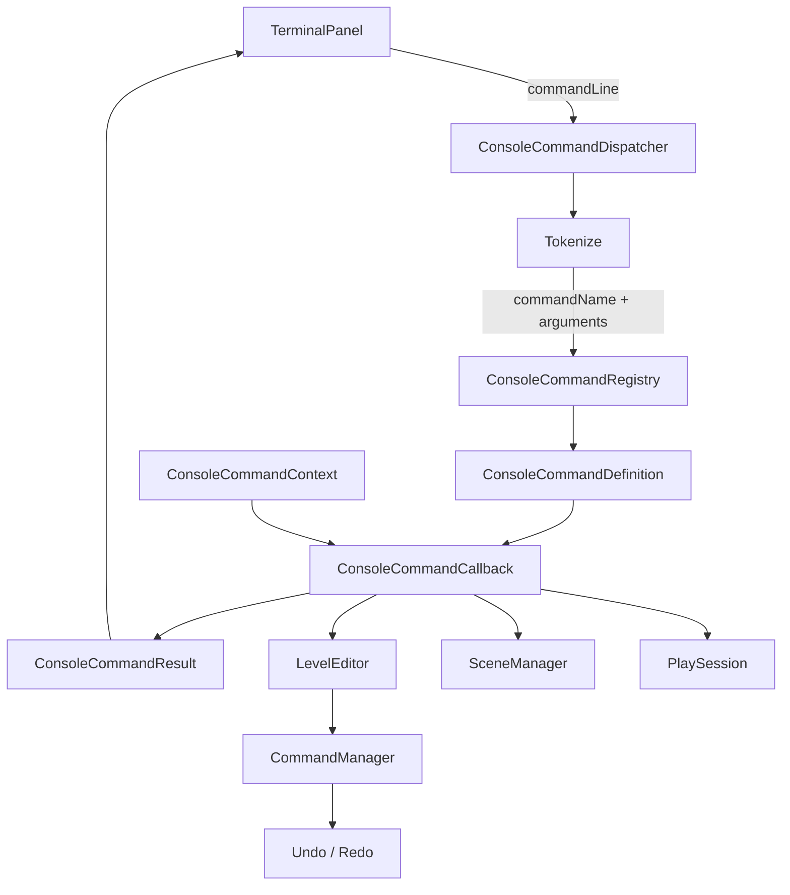

# Console Command System設計と実装比較

## 1. この資料の目的

この資料は、CalyxEngineのTerminalへコマンド機能を実装する際に採用したプログラム構成、設計上の工夫、他方式との比較、今後の拡張判断をまとめたものである。

実際のコマンド一覧と操作方法は`Docs/LogAndTerminalReadme.md`へ記載している。本資料は操作説明ではなく、実装者がコマンドを追加・保守するための設計資料として扱う。

## 2. 解決したい課題

初期実装では`ConsoleCommandDispatcher::Execute`の中で文字列を直接比較していた。

```cpp
if(command == "clear") {
    // Clear処理
}

if(command == "help") {
    // Help処理
}
```

2、3個のコマンドだけなら単純で分かりやすいが、シーン、オブジェクト、アセット、Play、ゲーム固有デバッグ等へ拡張すると次の問題が発生する。

- `Execute`が巨大な条件分岐になる。
- コマンド名、説明、Usage、処理が別々の場所へ散らばる。
- Game DLL側からコマンドを追加しにくい。
- `help`の一覧を手作業で更新する必要がある。
- コマンドごとの依存先が不明確になる。
- UIへ直接出力すると単体テストが難しくなる。
- 引数解析がコマンドごとに重複する。

そこで、入力解析、コマンド検索、コマンド実行、結果表示を分離した登録型システムへ変更した。

## 3. 現在の全体構成



処理の流れは次の通り。

1. `TerminalPanel`が入力文字列を受け取る。
2. `ConsoleCommandDispatcher`が先頭の`/`を検証し、コマンド名と引数へ分割する。
3. `ConsoleCommandRegistry`が正規化した名前から定義を検索する。
4. 登録コールバックへ`ConsoleCommandContext`と引数配列を渡す。
5. コールバックが`ConsoleCommandResult`を返す。
6. `TerminalPanel`が結果のInfo、Warning、Errorを色分け表示する。

## 4. クラスごとの責務

| クラス・構造体 | 責務 | 持たせない責務 |
| --- | --- | --- |
| `TerminalPanel` | 入力、履歴、結果の描画 | コマンド検索、シーン操作 |
| `ConsoleCommandDispatcher` | 引数分割、Registryへの実行委譲 | コマンド定義の永続管理、ImGui描画 |
| `ConsoleCommandRegistry` | 登録、解除、検索、一覧、コールバック実行 | 入力欄、Terminal履歴、シーン固有処理 |
| `ConsoleCommandDefinition` | 名前、説明、Usage、コールバックの一組 | 実行時Contextの所有 |
| `ConsoleCommandContext` | 実行時に利用可能なサービス参照 | サービスの生成、寿命管理 |
| `ConsoleCommandResult` | UIへ返す結果行とUI要求 | ImGui API呼び出し |

この分離により、Terminal以外の入力元からもRegistryを利用できる。例えば、将来リモートデバッグ接続や自動テストから同じコマンドを呼び出せる。

## 5. 登録型コマンドを採用した理由

コマンドは次の4要素を1つの定義として登録する。

```cpp
struct ConsoleCommandDefinition {
    std::string name;
    std::string description;
    std::string usage;
    ConsoleCommandCallback callback;
};
```

### 名前と処理を同じ場所へ置く

条件分岐方式では、処理本体とHelp一覧が別管理になりやすい。定義へ説明とUsageを含めることで、登録された情報から`help`を自動生成できる。

### EngineとGameで同じAPIを使う

Registryは`CALYX_API`でEngine DLLから公開している。Game DLL側もEngine組み込みコマンドと同じ`Register`を使える。

```cpp
ConsoleCommandRegistry::GetInstance().Register({
    "game.reload",
    "Reload game data.",
    "game.reload",
    callback
});
```

### コールバック方式で小さく始める

各コマンドを必ずクラスにすると、単純な`scene.current`にもヘッダー、実装、Factory登録が必要になる。現段階では`std::function`によるコールバックの方が実装量と拡張性のバランスがよい。

### ラムダ式を標準にしすぎない

`ConsoleCommandCallback`は`std::function`なのでラムダ式を登録できるが、すべてを巨大なインラインラムダで実装する必要はない。

短いコマンドにはラムダ式が適している。

```cpp
registry.Register({
    "clear",
    "Clear terminal history.",
    "/clear",
    [](const ConsoleCommandContext&, const auto&) {
        ConsoleCommandResult result;
        result.clearRequested = true;
        return result;
    }
});
```

シーンやオブジェクト操作のように検証と処理が増えるコマンドは、機能別ファイルの名前付き関数へ分ける方が追加・テストしやすい。

```cpp
namespace SceneConsoleCommands {
    ConsoleCommandResult Save(
        const ConsoleCommandContext& context,
        const std::vector<std::string>& arguments);

    void RegisterAll(ConsoleCommandRegistry& registry) {
        registry.Register({
            "scene.save",
            "Save the current scene.",
            "/scene.save",
            Save
        });
    }
}
```

推奨する分割単位は次の通り。

```text
Engine/System/Command/ConsoleCommands/
  ├─ BuiltInConsoleCommands.cpp
  ├─ SceneConsoleCommands.cpp
  ├─ ObjectConsoleCommands.cpp
  ├─ AssetConsoleCommands.cpp
  └─ PlayConsoleCommands.cpp
```

この方式ならRegistryの仕組みを変えず、次の利点を得られる。

- Dispatcherがコマンド本体で肥大化しない。
- 名前付き関数を直接テストできる。
- Scene、Asset等の担当領域ごとにファイルを所有できる。
- 1コマンド1クラス方式ほどボイラープレートが増えない。
- 必要になった複雑なコマンドだけクラスへ昇格できる。

したがって、ラムダ式は短いアダプターに限定し、標準的な追加方法は「機能別RegisterAll + 名前付きハンドラー」とするのが適切である。

## 6. 名前の正規化

コマンド名は登録時と検索時に小文字へ変換する。

```text
HELP
Help
help
```

上記はすべて同じ`help`として検索される。ユーザーが大小文字を意識せず操作でき、Game側が表記の違う重複コマンドを登録することも防げる。

引数は小文字化しない。ファイルパス、SceneObject名、ゲーム固有ID等は大文字・小文字が意味を持つ可能性があるためである。

## 7. ConsoleCommandContextによる依存の明示

コマンド内から必要なサービスをすべてシングルトン探索すると、何へ依存しているかがコールバック本体を読むまで分からない。また、テスト用の差し替えも困難になる。

現在は、Terminalから利用を許可するサービスを`ConsoleCommandContext`へまとめている。

```cpp
struct ConsoleCommandContext {
    LevelEditor* levelEditor;
    SceneManager* sceneManager;
    PlaySession* playSession;
};
```

`LevelEditor`は`SetSceneManager`、`SetPlaySession`のタイミングでContextを更新する。Terminalはサービスを所有せず、現在有効な参照だけを保持する。

### この方式の利点

- コマンドが利用可能な機能を型として確認できる。
- Contextが不足している場合に明示的なエラーを返せる。
- UIがSceneManager等の生成順を管理しなくてよい。
- テスト用Contextを組み立てやすい。
- 将来、権限や実行ユーザー情報をContextへ追加できる。

### raw pointerを採用している理由

Contextはサービスを所有しないため、`unique_ptr`や`shared_ptr`ではなく非所有のraw pointerを使う。エディタの同期実行中だけ参照し、各サービスのsetterで最新値へ更新する前提である。

非同期コマンドを追加する場合は、このraw pointerをバックグラウンド処理へそのまま保持してはいけない。非同期化時には、寿命保証されたHandle、タスクキュー、メインスレッドへのDispatch等が必要になる。

## 8. 結果を戻り値として返す工夫

コマンドコールバックはImGuiや`TerminalPanel::AddLine`を直接呼ばず、`ConsoleCommandResult`を返す。

```cpp
struct ConsoleCommandResult {
    bool clearRequested;
    std::vector<ConsoleOutputLine> output;
};
```

各出力行はInfo、Warning、Errorのレベルと文字列を持つ。

### 直接UIへ出力しない利点

- コマンドがImGuiに依存しない。
- 結果を単体テストで比較できる。
- Terminal以外の表示先へ転送できる。
- 複数行の結果を自然に返せる。
- UI側で色やレイアウトを自由に決められる。

`clearRequested`は文字列出力では表現できないTerminal固有アクションである。今後、コピー、フォーカス移動、別タブ表示等が増える場合は、boolを増やし続けず`std::variant<ConsoleAction...>`等のアクション配列へ移行する方がよい。

## 9. 引数パーサーの設計

Terminalへ入力するコマンドは必ず`/`から始める。`/`は通常文字列とコマンド入力を区別するUI上の接頭辞であり、Dispatcherが検証して取り除いてからRegistryへ渡す。

現在のパーサーは、コマンドラインを次の形式で分割する。

```text
/command arg1 arg2
/command "argument with spaces"
/command 'argument with spaces'
```

Windowsパスを壊さないため、バックスラッシュは常にエスケープ文字として消費しない。引用符内で、同種の引用符またはバックスラッシュをエスケープするときだけ特別扱いする。

```text
/scene.open "C:\Project\Assets\Scenes\Test Stage.scene"
```

閉じていない引用符は実行前に検出し、構文エラーとして返す。

### 意図的に実装していない構文

- パイプ`|`
- リダイレクト`>`、`>>`
- 環境変数展開
- ワイルドカード展開
- サブコマンド実行
- 複数コマンドをつなぐ`;`
- 空文字引数`""`の厳密な保持

ゲームエンジン内デバッグコマンドとして必要な範囲を超えるため、シェル互換機能は実装していない。必要になるまでは`/command + vector<string>`を維持する。

## 10. Registryを利用したTab補完

Terminalは入力中の文字列からRegistryを検索し、入力欄の直上へコマンド名と説明をリアルタイム表示する。

```text
/scene.c
  /scene.current    Show the current scene name and path.
```

候補一覧は最大7行分の高さを確保し、それ以上はスクロール表示する。`↑/↓`で選択、TabまたはEnterで補完、マウスクリックでも補完できる。

```text
/scene.
  /scene.current    Show the current scene name and path.
  /scene.open       Open a scene file in the editor.
  /scene.save       Save the current scene.
```

入力が完全なコマンド名と一致する場合、Enterは補完ではなく実行として扱う。固定候補ではなく`GetCommands()`を参照するため、Game側で追加されたコマンドも自動的に補完対象になる。現在はコマンド名だけを対象とし、パスやSceneObject名等の引数補完は行わない。

## 11. Helpをメタデータから生成する

`/help`は固定文字列のコマンド一覧を持たない。Registryの`GetCommands()`から登録済み定義を取得し、名前順に表示する。

この方式ではGame側がコマンドを登録するだけでHelpへ反映される。コマンド追加時に一覧更新を忘れる問題がない。

`/help <command>`は`description`と`usage`を表示する。

```text
/object.delete - Delete an object by exact name or GUID. The operation supports Undo.
Usage: /object.delete <name|guid>
```

説明文とUsageは実装の一部として扱い、コマンド登録時の必須レビュー項目にする。

## 12. スレッド安全性とロック範囲

Registryの`Register`、`Unregister`、`Find`、`GetCommands`は`std::mutex`で保護している。

重要なのは、コールバック実行中にRegistryのmutexを保持しない点である。

```text
Find時:
  mutexをLock
  CommandDefinitionをコピー
  mutexをUnlock

Execute時:
  コピーしたcallbackを実行
```

コールバックから別コマンドを登録・解除したり、`help`が`GetCommands()`を呼んだりしても自己デッドロックしない。

ただし、RegistryがスレッドセーフでもSceneManagerやLevelEditorがスレッドセーフになるわけではない。現在のコマンド実行はTerminalのあるメインスレッドで同期実行する。

## 13. 例外境界

外部ライブラリ、Game DLL、ファイル処理等のコールバックが例外を投げる可能性がある。例外がTerminalの描画ループまで抜けるとエディタ全体が停止する。

Registryはコールバック呼び出しを`try/catch`で囲み、例外をError結果へ変換する。

```text
Command failed: <exception message>
```

未知の例外も`Command failed with an unknown exception.`として処理する。

ただし、アクセス違反やDirectX Device Removed等の構造化例外はC++例外ではないため、この境界だけでは回復できない。

## 14. DLL境界と登録解除

RegistryはEngine DLL内のシングルトンであり、Game DLLから登録した`std::function`も保持できる。

Game DLLをアンロードする場合、RegistryにGame DLL内関数を指すコールバックが残ると、次回実行時に無効アドレスを呼び出す。そのため、モジュール終了時に必ず解除する。

```cpp
void GameModule::Shutdown() {
    ConsoleCommandRegistry::GetInstance().Unregister("game.reload");
}
```

### 同名コマンドの上書き

現在の`Register`は同名定義を上書きする。Game側でEngine標準コマンドを意図的に差し替えられる利点がある一方、登録順によって結果が変わる。

通常はTerminal生成時に組み込みコマンドが登録され、その後Game側コマンドを登録する。初期化順が変わる場合は注意する。

将来は次の登録ポリシーを指定できる形が望ましい。

```cpp
enum class CommandRegisterPolicy {
    RejectDuplicate,
    ReplaceExisting,
    KeepExisting
};
```

また、Game DLLとEngine DLLは同じC++ランタイムと互換ABIを使う必要がある。`std::function`や`std::string`をDLL境界で渡す現在のエンジン設計全体と同じ制約である。

## 15. Editor CommandManagerとの区別

Console CommandとEditor Commandは目的が異なる。

| システム | 目的 |
| --- | --- |
| `ConsoleCommandRegistry` | 文字列から機能を検索・実行し、結果を返す |
| `CommandManager` | エディタの状態変更をUndo/Redo可能にする |

読み取り専用コマンドはRegistryのコールバックだけで完結する。

```text
scene.current
object.list
```

状態を変更するコマンドは、既存のEditor操作APIを呼び、その内部で`CommandManager`を通す。

```text
object.delete
  -> LevelEditor::DeleteObject
  -> DeleteSceneObjectsCommand
  -> CommandManager
  -> Undo / Redo可能
```

Terminalから直接SceneObjectLibraryを変更するとUndo履歴、Hierarchy更新、選択解除等が抜けるため避ける。

## 16. 他の実装方式との比較

### 比較表

| 方式 | 追加の容易さ | Help自動生成 | Game DLL拡張 | Undo連携 | 実装量 | 採用判断 |
| --- | --- | --- | --- | --- | --- | --- |
| if/else・switch | 小規模なら容易 | 弱い | 弱い | 個別対応 | 最小 | 初期試作向け |
| enum + switch | 型安全 | 弱い | enum再ビルドが必要 | 個別対応 | 小 | 固定コマンド向け |
| ICommand派生クラス | 中程度 | メタ情報追加が必要 | 可能 | 強い | 大 | 複雑な状態変更向け |
| callback Registry | 容易 | 強い | 強い | Editor API経由 | 中 | 現在採用 |
| Script VM/Lua | Scriptから容易 | 別途設計 | 強い | 別途設計 | 大 | ゲームスクリプト導入後 |
| 外部CLI Parser | 引数機能が豊富 | ライブラリ次第 | 可能 | 個別対応 | 中～大 | 複雑なCLIが必要な場合 |

### if/else方式との比較

利点:

- 処理順が見やすい。
- 依存クラスが不要。
- コマンド数が少ない場合は最短で実装できる。

欠点:

- 追加するたびDispatcherを編集する。
- Game DLLから後付けできない。
- Help、Usage、処理が同期しにくい。
- 単一関数が肥大化する。

CalyxEngineでは組み込みコマンドとGame固有コマンドの両方を想定するため、最終構成には適さない。

### enum + switch方式との比較

文字列をenumへ変換してswitchする方式はタイプミスを減らせるが、新しいコマンド追加時に共通enumとswitchを変更する必要がある。DLLロード後にGame側から動的追加する用途には向かない。

### ICommand派生クラス方式との比較

```cpp
class DeleteObjectConsoleCommand : public IConsoleCommand {
public:
    ConsoleCommandResult Execute(...) override;
};
```

クラス方式は、複雑な状態、複数ステップ、非同期進行を持つコマンドに向いている。単純な照会コマンドまでクラス化するとファイル数とボイラープレートが増える。

現在はcallbackを標準とし、複雑な処理だけ専用オブジェクトをcallbackから呼ぶ構成が実用的である。

### Script VM方式との比較

Lua等を導入すると、C++再ビルドなしでコマンドを追加できる。ゲームオブジェクト生成やテストシナリオ記述にも発展できる。

一方、Script VM、Binding、エラー報告、寿命、権限、デバッグ機構が必要になる。現在の目的はEngine内部機能へ小さな入口を作ることなので、C++ callback Registryの方が適切である。

### 外部CLIライブラリとの比較

CLI11等のライブラリを使えば、型付き引数、オプション、必須引数、Help生成を利用できる。ただし、一般的なプロセス起動時CLIを前提とする設計と、フレーム中に何度も実行するゲーム内Terminalでは要求が異なる。

`--option`やサブコマンドが増えた段階で再検討し、現状は依存追加を避けた小さなTokenizeを採用している。

## 17. 現在方式のトレードオフ

### 利点

- コマンド追加が1つの登録処理で完結する。
- Helpが登録情報から生成される。
- Engine/Gameの両方から登録できる。
- UI、解析、検索、実処理が分離されている。
- Contextで依存先を制限できる。
- 結果をテストしやすい。
- コールバック例外でエディタ全体が落ちにくい。
- 状態変更を既存CommandManagerへ接続できる。

### 欠点

- `std::function`と定義コピーのコストがある。
- 引数はすべて`std::string`で、型変換を各コマンドが行う必要がある。
- 同名上書きが登録順に依存する。
- Contextのraw pointerは非同期保持できない。
- 高度な補完、オプション、パイプ等を持たない。
- 組み込みコマンド登録が現在Dispatcherの実装ファイルへ集中している。

コマンド実行頻度はフレーム処理と比べて極めて低いため、`std::function`や定義コピーのコストより安全なロック範囲を優先している。

## 18. コマンド追加時の実装手順

1. コマンド名を`domain.action`形式で決める。
2. 1文の`description`を書く。
3. 引数を含む正確な`usage`を書く。
4. 引数数を最初に検証する。
5. Context内の必要サービスがnullでないか確認する。
6. 読み取り処理か状態変更処理かを判断する。
7. 状態変更なら既存Editor APIまたはCommandManagerを経由する。
8. 成功と失敗を`ConsoleCommandResult`で返す。
9. 重要な状態変更は`EngineLogger`にも記録する。
10. Game DLLコマンドなら終了時の`Unregister`を実装する。
11. `help`と実行例で登録内容を確認する。
12. READMEのコマンド一覧を更新する。

### 命名例

```text
scene.open
scene.save
object.list
object.delete
asset.rescan
play.start
```

`openScene`のような動詞先頭形式より、機能領域を先頭にした方がHelp一覧で関連コマンドがまとまる。

## 19. 実装例

### 読み取り専用コマンド

```cpp
registry.Register({
    "game.status",
    "Show current game status.",
    "game.status",
    [](const ConsoleCommandContext& context,
       const std::vector<std::string>& arguments) {
        if(!arguments.empty()) {
            return ConsoleCommandResult{
                false,
                {{ConsoleOutputLevel::Error, "Usage: game.status"}}};
        }

        return ConsoleCommandResult{
            false,
            {{ConsoleOutputLevel::Info, "Game status: Ready"}}};
    }
});
```

### 引数を持つ状態変更コマンド

```cpp
registry.Register({
    "game.difficulty",
    "Change game difficulty.",
    "game.difficulty <easy|normal|hard>",
    [](const ConsoleCommandContext& context,
       const std::vector<std::string>& arguments) {
        if(arguments.size() != 1) {
            return ConsoleCommandResult{
                false,
                {{ConsoleOutputLevel::Error,
                  "Usage: game.difficulty <easy|normal|hard>"}}};
        }

        const std::string& value = arguments.front();
        if(value != "easy" && value != "normal" && value != "hard") {
            return ConsoleCommandResult{
                false,
                {{ConsoleOutputLevel::Error,
                  "Difficulty must be easy, normal, or hard."}}};
        }

        // Game側サービスへ変更を適用する。
        EngineLogger::GetInstance().Add(
            LogLevel::Info,
            LogCategory::Game,
            "Difficulty changed: " + value,
            "GameCommand");

        return ConsoleCommandResult{
            false,
            {{ConsoleOutputLevel::Info,
              "Difficulty changed: " + value}}};
    }
});
```

## 20. テスト方針

UIから手動入力するだけでなく、次の単位でテストできる構成にする。

### Tokenize

```text
/scene.open Test.scene
/scene.open "Test Stage.scene"
/object.select 'Main Camera'
/scene.open "unclosed
```

正常なtoken配列と、未閉じ引用符のエラーを確認する。現在`Tokenize`はprivateなので、自動テストを増やす段階で独立した`ConsoleCommandParser`へ抽出する。

### Registry

- 登録したコマンドを検索できる。
- 大文字・小文字を無視できる。
- 同名登録で上書きされる。
- Unregister後はUnknown Commandになる。
- GetCommandsが名前順になる。
- callback例外がErrorへ変換される。

### Context

- 必要サービスがnullの場合にErrorを返す。
- テスト用SceneManager等を渡して成功結果を確認する。
- 状態変更コマンドがCommandManagerへ積まれる。

## 21. 今後の拡張順序

優先順位は次の通り。

1. 上下キーによる入力履歴。
2. ファイルパス、SceneObject名等の引数補完。
3. typed argument変換ヘルパー。
4. Editor専用、Game専用、Debug専用等の実行フラグ。
5. コマンドカテゴリとHelp絞り込み。
6. Game DLL単位の一括Unregister。
7. 非同期コマンド結果とキャンセル。
8. 必要になった段階でScript VM連携。

現在の登録型基盤を維持したまま段階的に追加し、本格的なシェル実装へ不要に広げないことが重要である。
