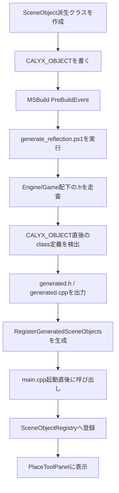
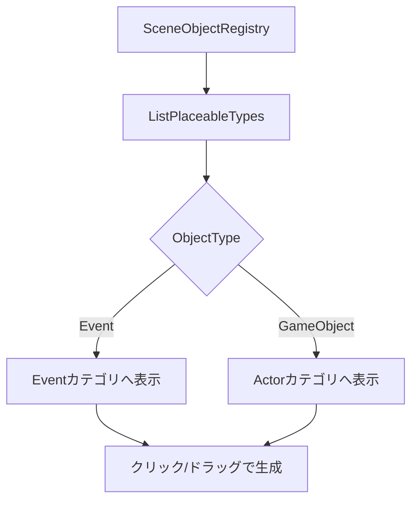
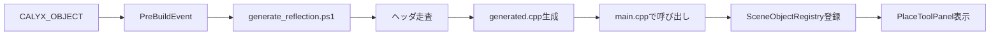
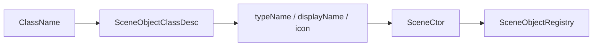

# エディタ機能: 配置可能クラスの自動登録

このREADMEは、発表資料に載せるための下書きです。  
`CALYX_OBJECT(...)` マーカー、`Tools/Reflection/generate_reflection.ps1`、MSBuildのPreBuildEvent、`SceneObjectRegistry` への登録までをまとめます。

## 1. 概要

エディタに配置できる `SceneObject` 系クラスを、ビルド前に自動収集して `SceneObjectRegistry` へ登録する仕組みです。

新しいオブジェクトクラスを作成したとき、従来のように登録用cppへ手動で追記するのではなく、クラス定義の直前に `CALYX_OBJECT(...)` を書くだけで、ビルド時に登録コードが生成されます。

```cpp
#include <Engine/Foundation/Reflection/CalyxReflection.h>

CALYX_OBJECT(Category = Event, DisplayName = "Camera Event")
class CameraEventObject : public BaseEventObject {
public:
    CameraEventObject();
};
```

このプロジェクトでは、C++の実行時リフレクションではなく、ビルド前スクリプトによるコード生成方式を採用しています。

## 2. 制作意図

エディタで配置できるオブジェクトが増えるほど、Registryへの手動登録は手間になります。

特に、イベントオブジェクトやギミックを追加するたびに、以下のような作業が必要になるとミスが起きやすくなります。

| 課題 | 解決したかったこと |
| --- | --- |
| クラス追加後に登録コードを手書きする必要がある | マーカーを読むだけで登録コードを自動生成する |
| 登録漏れでエディタに表示されない | ビルド時に対象クラスを自動収集する |
| 表示名やカテゴリが別ファイルに散らばる | クラス定義の近くにメタ情報を書く |
| Engine側とGame側の追加方法がばらつく | 同じ `CALYX_OBJECT(...)` で登録できるようにする |

発表では、次のように説明すると意図が伝わりやすいです。

> 新しい配置可能オブジェクトを追加したときに、登録コードを毎回手で書くと登録漏れが起きやすくなります。  
> そこで、クラス定義の近くに `CALYX_OBJECT(...)` を書くだけで、ビルド前に登録コードを生成する仕組みにしました。

## 3. 実装構成

主な実装ファイルは以下です。

| ファイル | 役割 |
| --- | --- |
| `Engine/Foundation/Reflection/CalyxReflection.h` | `CALYX_OBJECT` などのマーカー定義 |
| `Tools/Reflection/generate_reflection.ps1` | MSBuildから実行されるPowerShell版Generator |
| `Tools/Reflection/generate_reflection.py` | Python版Generator。現在のPreBuildEventでは未使用 |
| `Engine/Foundation/Reflection/CalyxObjectRegistry.generated.h` | 自動生成される登録関数の宣言 |
| `Engine/Foundation/Reflection/CalyxObjectRegistry.generated.cpp` | 自動生成される登録処理 |
| `main.cpp` | 起動直後に `RegisterGeneratedSceneObjects()` を呼び、Registryへ反映 |
| `Engine/Objects/3D/Actor/Registry/SceneObjectRegistry.*` | 型名からSceneObjectを生成するRegistry |
| `Engine/Application/UI/Panels/PlaceToolPanel.cpp` | Registryから配置可能クラスを取得し、配置UIに表示 |
| `CalyxEngineLib.vcxproj` | PreBuildEventでGeneratorを実行 |

## 4. 全体の流れ



ポイントは、エディタ起動中にヘッダを解析しているのではなく、ビルド前にC++コードを生成している点です。

そのため、実行時には `main.cpp` の起動直後に生成関数を呼び出し、通常のC++関数呼び出しとしてRegistry登録が行われます。

## 5. MSBuild PreBuildEvent

`CalyxEngineLib.vcxproj` では、各構成のPreBuildEventで以下のスクリプトを実行しています。

```text
powershell -NoProfile -ExecutionPolicy Bypass -File "$(ProjectDir)Tools\Reflection\generate_reflection.ps1"
```

これにより、ビルド前に常に最新のヘッダ情報をもとに生成ファイルが更新されます。

手動でGeneratorを実行する作業を不要にし、クラス追加後にビルドするだけでエディタ登録まで進むようにしています。

## 6. CALYX_OBJECTの役割

`CALYX_OBJECT(...)` はC++上では空マクロです。

```cpp
#define CALYX_OBJECT(...)
```

実行時に何かを行うためのマクロではなく、Generatorがヘッダを走査するときの目印として使います。

指定できる主な項目は以下です。

| 項目 | 内容 | 例 |
| --- | --- | --- |
| `Category` | `ObjectType` に対応するカテゴリ | `Event`, `GameObject` |
| `DisplayName` | エディタ上の表示名 | `"Camera Event"` |
| `Icon` | 配置パネルで使うアイコン | `"UI/Tool/event.png"` |
| `Placeable` | 配置パネルに出すか | `true`, `false` |
| `TypeName` | Registryで使う型名 | `"CameraEventObject"` |
| `PrefabEditable` | Prefab編集候補に出すか | `true`, `false` |
| `PrefabRoot` | Prefab Root候補にするか | `true`, `false` |

最小構成:

```cpp
CALYX_OBJECT(Category = Event, DisplayName = "Tutorial Event")
class TutorialEvent : public BaseEventObject {
public:
    TutorialEvent();
};
```

## 7. Generatorの処理

`generate_reflection.ps1` は、`Engine` と `Game` 配下の `.h` ファイルを再帰的に走査します。

検出には正規表現を使っています。

```text
CALYX_OBJECT(...) の直後にある class ClassName :
```

検出後、メタ情報を解析し、以下のような `SceneObjectClassDesc` を生成ファイルへ書き出します。

```cpp
{
    SceneObjectClassDesc desc;
    desc.typeName = "CameraEventObject";
    desc.displayName = "Camera Event";
    desc.objectType = ObjectType::Event;
    desc.iconPath = "UI/Tool/event.png";
    desc.placeable = true;
    desc.prefabEditable = false;
    desc.prefabRoot = false;
    desc.ctor = std::make_unique<SceneCtor<CameraEventObject>>();
    SceneObjectRegistry::Get().Register(std::move(desc));
}
```

生成時には `Write-IfChanged` を使い、内容が変わったときだけファイルを書き換えます。  
これにより、不要な再ビルドや差分発生を抑えています。

## 8. SceneObjectRegistryとの連携

`SceneObjectRegistry` は、文字列の型名からSceneObjectを生成するためのRegistryです。

```cpp
std::shared_ptr<SceneObject> SceneObjectRegistry::Create(std::string_view name) const;
```

登録時には、型名、表示名、カテゴリ、アイコン、配置可能フラグ、生成用ctorを `SceneObjectClassDesc` として保持します。

```mermaid
flowchart LR
    A[typeName] --> B[SceneObjectRegistry]
    B --> C[SceneCtor<T>]
    C --> D[std::make_shared<T>()]
    D --> E[SceneObject生成]
```

このRegistryは、エディタの配置だけでなく、SceneやPrefabの読み込みでも利用できます。  
保存データに含まれる `type` 文字列から、対応するC++クラスを生成できるためです。

## 9. PlaceToolPanelへの表示

`PlaceToolPanel` は `SceneObjectRegistry::ListPlaceableTypes()` を呼び出し、配置可能なクラス一覧を取得します。

`ObjectType::Event` のものはEventカテゴリへ、`ObjectType::GameObject` のものはActorカテゴリへ追加されます。



これにより、新しいクラスを追加したあと、配置パネル側のコードを直接編集しなくても、エディタ上に表示できます。

## 10. 他の実装方法との比較

| 実装案 | メリット | デメリット | 採用判断 |
| --- | --- | --- | --- |
| 配置パネルに手動追加 | 実装が単純 | 登録漏れ、表示名不一致、追加作業の重複が起きる | 不採用 |
| 各cppで静的登録マクロを使う | 実行時に自動登録できる | 静的初期化順序やリンク対象外の問題が起きやすい | 不採用 |
| 実行時にヘッダを解析する | ビルド不要で更新できる可能性 | 起動が重く、C++構文解析が不安定 | 不採用 |
| C++の本格的なリフレクション基盤を作る | 拡張性が高い | 実装コストが高く、今回の目的に対して過剰 | 不採用 |
| ビルド前コード生成 | 追加作業を減らし、実行時は通常のC++として扱える | 正規表現ベースなので書き方に制約がある | 採用 |

今回の目的は、プロパティ全体の本格的なリフレクションではなく、「エディタに配置できるクラスの自動収集」です。  
そのため、低コストで導入でき、既存のC++コードと相性がよいビルド前コード生成を選びました。

## 11. 設計的な工夫点

| 工夫点 | 説明 |
| --- | --- |
| 空マクロをマーカーとして使用 | C++側の実行時負荷を増やさず、Generatorだけが読み取れる |
| PreBuildEventで自動実行 | 手動生成を不要にし、ビルド時に登録情報を更新できる |
| Engine/Game両方を走査 | エンジン標準オブジェクトとゲーム固有オブジェクトを同じ仕組みで登録できる |
| 生成コードは通常のC++ | 実行時の処理はRegistry登録だけで、複雑な解析処理を持ち込まない |
| SceneObjectClassDescにメタ情報を集約 | 表示名、カテゴリ、アイコン、配置可否をRegistry側で一元管理できる |
| Write-IfChanged | 内容が変わったときだけ生成ファイルを更新し、不要な差分を抑える |

## 12. 現在の制限・注意点

| 制限 | 内容 |
| --- | --- |
| 正規表現ベース | 複雑なC++構文には対応しない |
| マーカー位置に制約 | `CALYX_OBJECT(...)` はクラス定義の直前に置く必要がある |
| 対象ファイルに制約 | `Engine` または `Game` 配下の `.h` が対象 |
| デフォルト生成が必要 | `std::make_shared<ClassName>()` で生成できる必要がある |
| プロパティ収集は未実装 | 現状は配置可能クラスの収集が中心 |

生成された登録関数は、`main.cpp` の起動直後に呼び出します。  
これにより、エディタの各UIが初期化される前に `SceneObjectRegistry` へ配置可能クラスを登録できます。

```cpp
#include <Engine/Foundation/Reflection/CalyxObjectRegistry.generated.h>

CalyxEngine::RegisterGeneratedSceneObjects();
```

## 13. 資料用スライド案

### スライド1: 自動登録の目的

見せ方: Before / After表。

| Before | After |
| --- | --- |
| クラス追加後に登録コードを手書き | `CALYX_OBJECT` を書いてビルド |
| 登録漏れでエディタに出ない | ビルド前に自動収集 |
| 表示名やカテゴリが散らばる | クラス定義の近くにメタ情報を書く |

### スライド2: 全体の流れ

見せ方: `CALYX_OBJECT` からPlaceToolPanel表示までのフロー図。  
キーワードは「PreBuildEvent」「Generator」「generated.cpp」「Registry」。

### スライド3: CALYX_OBJECTの役割

見せ方: コード例と項目表。  
`Category`, `DisplayName`, `Icon`, `Placeable` を中心に見せる。

### スライド4: なぜビルド前コード生成か

見せ方: 比較表。  
「手動登録」「静的登録」「実行時解析」「ビルド前生成」を比較する。

### スライド5: まとめ

見せ方: 工夫点を4つ程度に絞る。  
「登録漏れ削減」「Game側も対応」「Registry一元管理」「実行時負荷を増やさない」。

## 14. 各スライドに載せる文章案

### スライド1: エディタ配置クラスの自動登録

表示用テキスト:

```text
SceneObject系クラスにCALYX_OBJECTを付けるだけで、
エディタの配置パネルへ自動登録できる仕組みを実装しました。

目的:
- 登録コードの手書きを減らす
- 登録漏れを防ぐ
- Game側の固有オブジェクトも同じ手順で追加する
```

口頭補足:

```text
新しいイベントや配置可能オブジェクトを作るたびに、別ファイルへ登録処理を書くのは手間で、登録漏れも起きやすいです。
そこで、クラス定義の近くにマーカーを書く方式にしました。
```

載せる表:

| Before | After |
| --- | --- |
| 登録コードを手書き | マーカーを書いてビルド |
| 登録漏れが起きる | ビルド前に自動収集 |
| UI側も修正が必要 | Registry経由で一覧表示 |

### スライド2: 全体の処理フロー

表示用テキスト:

```text
MSBuildのPreBuildEventでスクリプトを実行し、
CALYX_OBJECTが付いたクラスから登録コードを生成します。

生成された登録関数はmain.cppの起動直後に呼び出します。
```

載せる図:



口頭補足:

```text
エディタ起動中に解析しているわけではなく、ビルド前にC++コードを生成しています。
実行時はmain.cppの最初で生成済みの関数を呼び、各パネルが作られる前にRegistryへ登録します。
```

### スライド3: CALYX_OBJECTに書く情報

表示用テキスト:

```text
クラス定義の直前に、エディタ表示用のメタ情報を書きます。
```

載せるコード:

```cpp
CALYX_OBJECT(
    Category = Event,
    DisplayName = "Camera Event",
    Icon = "UI/Tool/event.png"
)
class CameraEventObject : public BaseEventObject {
};
```

載せる表:

| 項目 | 用途 |
| --- | --- |
| Category | Event / GameObjectなどの分類 |
| DisplayName | エディタ上の表示名 |
| Icon | 配置パネルのアイコン |
| Placeable | 配置パネルに出すか |

口頭補足:

```text
CALYX_OBJECT自体はC++では空マクロです。
実行時の処理ではなく、Generatorが読み取るための目印として使っています。
```

### スライド4: 生成される登録コード

表示用テキスト:

```text
GeneratorはSceneObjectClassDescを作成し、
SceneObjectRegistryへ登録するC++コードを出力します。
```

載せる図:



口頭補足:

```text
Registryには、型名だけでなく表示名やアイコン、配置可能かどうかも登録しています。
そのため、PlaceToolPanelはRegistryの一覧を見るだけでUIを作れます。
```

### スライド5: 他実装との比較

表示用テキスト:

```text
手動登録ではなく、ビルド前コード生成を選びました。
登録漏れを減らしつつ、実行時は通常のC++として扱えるためです。
```

載せる表:

| 実装案 | 問題点 | 判断 |
| --- | --- | --- |
| 手動登録 | 登録漏れが起きやすい | 不採用 |
| 静的登録 | 初期化順序に依存しやすい | 不採用 |
| 実行時解析 | 起動時負荷と解析の不安定さ | 不採用 |
| ビルド前生成 | 追加作業を減らし実行時も軽い | 採用 |

口頭補足:

```text
今回は本格的なリフレクションを作ることが目的ではなく、配置可能クラスの登録を楽にすることが目的です。
そのため、必要な範囲に絞ったコード生成方式にしました。
```

### スライド6: まとめ

表示用テキスト:

```text
自動登録により、クラス追加からエディタ配置までの手順を簡略化しました。

主な工夫:
- CALYX_OBJECTをマーカーとして利用
- PreBuildEventで登録コードを生成
- SceneObjectRegistryで生成処理を一元管理
- PlaceToolPanelがRegistryから一覧表示
```

口頭補足:

```text
この仕組みにより、エンジニアはクラスを作成してマーカーを書く流れだけで、エディタに配置可能なオブジェクトを追加できます。
登録漏れを減らし、プランナーが新しいギミックをすぐ確認しやすくなる点が効果です。
```
