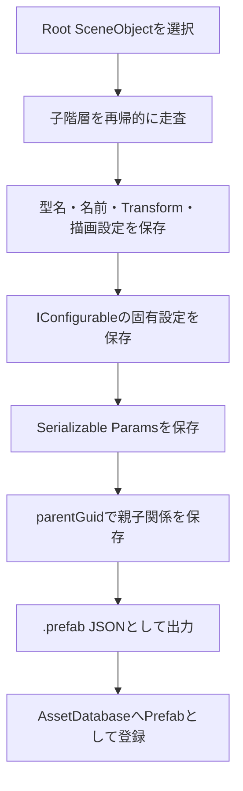
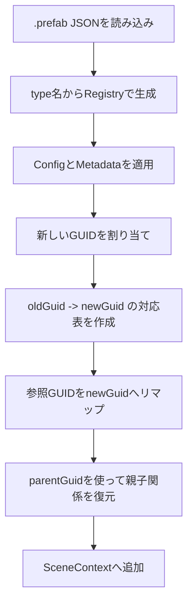
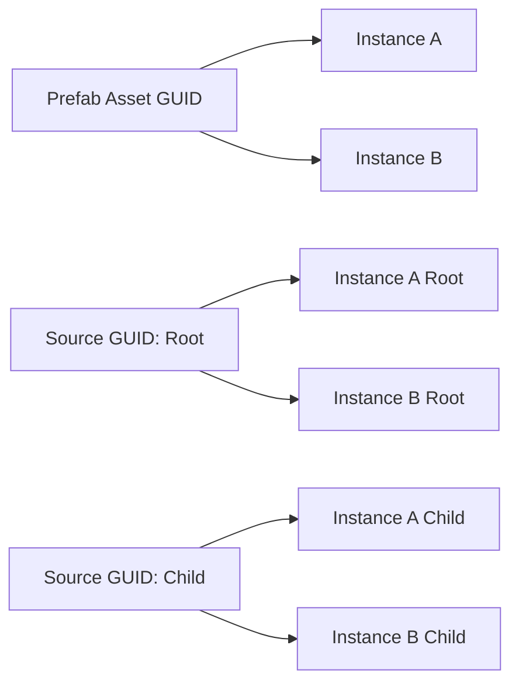
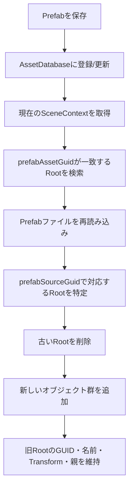
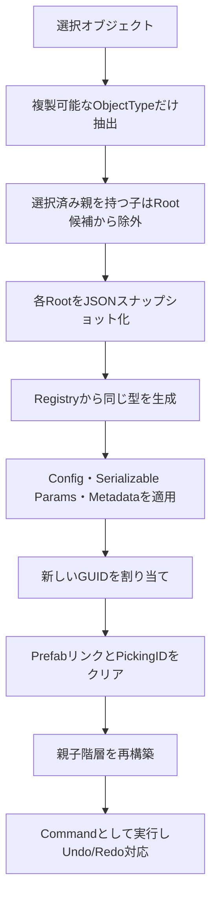
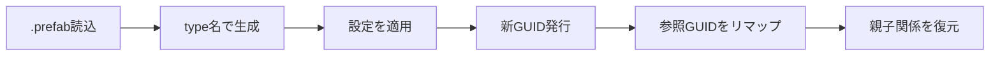
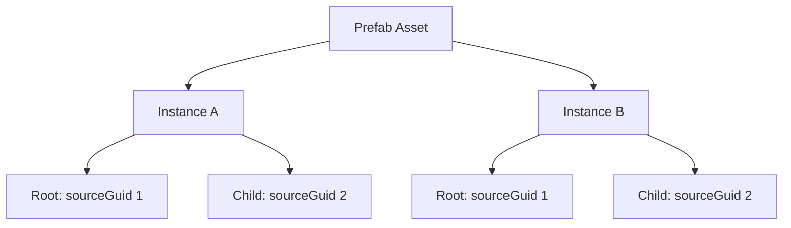
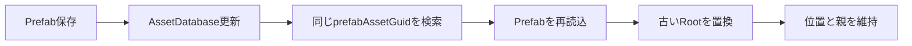

# エディタ機能: Prefab / オブジェクト複製

このREADMEは、発表資料に載せるための下書きです。  
「概要」「制作意図」「設計上の工夫」「他の実装方法との比較」「図・表の使い方」を中心にまとめます。

## 1. 概要

Prefabは、SceneObjectの階層構造と各種パラメータを `.prefab` ファイルとして保存し、同じ構成のオブジェクトをエディタ上で再利用できるようにする仕組みです。

このプロジェクトでは、Prefabを単なるモデル配置データではなく、以下をまとめて扱える再利用単位として実装しています。

| 保存対象 | 内容 |
| --- | --- |
| オブジェクト情報 | 型名、名前、ObjectType、描画フラグ、アウトライン設定など |
| Transform | 位置、回転、スケール、親子関係、継承設定 |
| 固有パラメータ | `IConfigurable` 経由で抽出される各オブジェクト固有の設定 |
| Serializable Params | `SerializableObject` のフィールド情報 |
| 参照関係 | GUIDを使ったオブジェクト間参照、親子関係、Prefabリンク |

オブジェクト複製は、選択中のSceneObjectを同じシーン内にコピーする機能です。複製時は直接メモリをコピーするのではなく、一度JSON形式のスナップショットに変換し、`SceneObjectRegistry` から同じ型のオブジェクトを再生成しています。

## 2. 制作意図

チーム制作では、同じようなオブジェクト構成を何度も配置する場面が多くあります。たとえば、イベントオブジェクト、敵の攻撃ギミック、複数の子オブジェクトを持つ演出用オブジェクトなどです。

Prefabと複製機能を作成した目的は、主に以下の3点です。

| 課題 | 解決したかったこと |
| --- | --- |
| 同じ構成を毎回手作業で作る必要がある | 一度作った構成をアセット化して再利用する |
| コード修正なしで配置や数値調整を行いたい | エディタ上で調整し、JSONデータとして保存する |
| 既に配置した同種オブジェクトの修正漏れが起きる | Prefab更新時にシーン内インスタンスへ同期する |

発表では、次のように説明すると意図が伝わりやすいです。

> Prefabは、プランナーが配置や調整を行うための作業単位です。  
> エンジニアがコードで毎回オブジェクトを組み直すのではなく、エディタ上で作成した構成をアセットとして保存し、必要な場所へ再配置できるようにしました。

## 3. 実装構成

主な実装ファイルは以下です。

| ファイル | 役割 |
| --- | --- |
| `Data/Engine/Prefab/Serializer/PrefabSerializer.*` | Prefabの保存・読み込み |
| `Engine/Editor/PrefabEditSession.*` | Prefab専用編集Contextの管理、保存、シーン内インスタンス同期 |
| `Engine/Editor/Prefab/PrefabEditContextUtils.*` | Prefab編集用の補助オブジェクト除外、Root正規化 |
| `Engine/Editor/SceneObjectDuplicator.*` | SceneObjectの複製 |
| `Engine/Application/UI/EngineUI/Viewport.cpp` | Prefabアセットのドラッグ配置、ゴースト表示 |
| `Engine/Application/UI/Panels/AssetPanel.cpp` | SceneObjectからPrefabアセットを作成 |
| `Engine/Application/UI/Panels/HierarchyPanel.cpp` | Hierarchy上でPrefab作成・読み込み・Override適用 |

## 4. Prefab保存の流れ

Prefab保存では、指定したRootオブジェクトから子階層を再帰的にたどり、各オブジェクトをJSON配列へ書き出します。



設計上のポイントは、親子関係をポインタではなくGUIDで保存している点です。ファイルに保存した時点でメモリ上のポインタは使えなくなるため、復元時に対応関係を再構築できるIDが必要になります。

また、Prefab保存時にはRootのTransformを正規化できます。`resetRootTransform` を使い、PrefabのRoot位置を原点に戻して保存することで、配置時に任意の位置へオフセットしやすくしています。

## 5. Prefab読み込みの流れ

Prefab読み込みでは、JSON内の `type` を使って `SceneObjectRegistry` から同じ型のインスタンスを生成します。その後、保存されていた設定を適用し、GUIDを再割り当てしてから親子関係を復元します。



読み込み時に新しいGUIDを割り当てることで、同じPrefabを複数配置しても、シーン内でGUIDが衝突しないようにしています。

一方で、Prefab編集時には `preserveGuids` を使い、Prefabファイル内のGUIDを維持して読み込むこともできます。これは、Prefab編集後に「どの元オブジェクトがどのインスタンスに対応するか」を追跡するためです。

## 6. Prefabリンクの管理

Prefabから生成されたオブジェクトには、以下の2つのGUIDを持たせています。

| GUID | 役割 |
| --- | --- |
| `prefabAssetGuid` | どのPrefabアセットから生成されたか |
| `prefabSourceGuid` | Prefab内のどの元オブジェクトに対応するか |

この2つを分けることで、同じPrefabから複数インスタンスを配置しても、各インスタンスの実体GUIDは別に保ちながら、Prefab元との対応関係を維持できます。



この設計により、Prefabを更新したときに、シーン内の対応するインスタンスを探して再読み込みできます。

## 7. Prefab専用編集Context

Prefab編集は、通常のゲームシーンとは別の `SceneContext` で行います。

理由は、Prefab編集中に必要なカメラやライト、プレビュー用オブジェクトをPrefabデータに混ぜないためです。

| 通常シーンで直接編集する場合 | 専用Contextで編集する場合 |
| --- | --- |
| 編集用カメラやライトが保存対象に混ざる危険がある | transient扱いにして保存対象から除外しやすい |
| 現在のゲームシーン状態に影響を与える | Prefabだけを独立して編集できる |
| Root位置や補助オブジェクトの管理が曖昧になる | Root正規化や補助オブジェクト除外を一元管理できる |

`PrefabEditContextUtils` では、カメラやプレビューライトを `transient` にし、保存対象から外しています。また、保存前にRootの位置を原点へ正規化しています。

## 8. シーン内インスタンス同期

Prefabを保存した後、`AssetDatabase` へ登録し、現在のシーン内にある同じPrefabインスタンスを同期します。



同期時には、配置済みインスタンスの位置や親は維持します。Prefab更新によって形や子階層は更新しつつ、シーン内での配置場所まで変わってしまわないようにするためです。

## 9. オブジェクト複製の設計

オブジェクト複製では、選択されたGameObject/Eventを複製対象にしています。`transient` な補助オブジェクトや、複製対象外のObjectTypeは除外します。

複製の流れは以下です。



複製時にPrefabリンクをクリアしている点も重要です。通常の複製は「現在のシーン上のオブジェクトを独立したコピーとして増やす」操作であり、Prefabインスタンスの同期対象として扱うと意図しない更新が起きる可能性があるためです。

## 10. 他の実装方法との比較

### Prefab保存方式の比較

| 実装案 | メリット | デメリット | 採用判断 |
| --- | --- | --- | --- |
| C++コードでオブジェクト構成を直接生成 | 実行速度が速く、型安全 | 調整のたびにコード修正とビルドが必要 | 不採用。プランナーが扱いにくい |
| オブジェクトをバイナリで保存 | ファイルサイズを小さくしやすい | 差分確認や手動修正が難しい | 不採用。制作中の検証に向かない |
| JSONで型名・GUID・パラメータを保存 | 人間が確認しやすく、エディタと相性が良い | バイナリよりサイズは大きい | 採用。制作中の調整とデバッグを優先 |
| Deep copy / コピーコンストラクタで複製 | 実装が単純に見える | 型ごとのコピー漏れ、参照の衝突が起きやすい | 不採用。複雑なSceneObjectに弱い |

### GUID設計の比較

| 実装案 | 問題点 | 現在の実装での解決 |
| --- | --- | --- |
| オブジェクト名で親子関係や参照を管理 | 同名オブジェクトで衝突する | GUIDで一意に管理 |
| 読み込み時もPrefab内GUIDをそのまま使う | 同じPrefabを複数配置するとGUIDが衝突する | 通常読み込みでは新規GUIDを発行 |
| Prefabとの対応情報を持たない | 更新時にどのインスタンスを置き換えるか判断できない | `prefabAssetGuid` と `prefabSourceGuid` を保持 |

## 11. 設計的な工夫点

発表資料では、以下を「工夫点」として出すと強いです。

| 工夫点 | 説明 |
| --- | --- |
| JSONスナップショット経由の生成 | 保存、読み込み、複製で近い経路を使い、型ごとのコピー漏れを減らした |
| Registryによる型生成 | 文字列の型名からSceneObjectを生成し、Prefab内の型を復元できる |
| GUIDリマップ | 複数配置時のID衝突を防ぎつつ、内部参照を正しい複製先へ向け直す |
| Prefab専用Context | 編集用カメラやライトをPrefabデータに混ぜず、通常シーンから独立して編集できる |
| Root Transform正規化 | Prefab自体は原点基準で保存し、配置時に任意位置へオフセットできる |
| AssetDatabase連携 | 保存後にPrefabアセットとして登録し、エディタ上でドラッグ配置できる |
| インスタンス同期 | Prefab更新を既存配置へ反映し、修正漏れを減らす |
| Command化された複製 | 複製操作をUndo/Redo可能にして、エディタ操作として扱いやすくした |

## 12. 資料用スライド案

### スライド1: Prefab / 複製の目的

見せ方: 課題と解決を2列の表にする。

| Before | After |
| --- | --- |
| 同じ構成を毎回手作業で作成 | Prefab化して再利用 |
| 変更のたびにコード修正が必要 | エディタ上で調整して保存 |
| 配置済みオブジェクトの修正漏れ | Prefab更新でインスタンス同期 |

### スライド2: Prefab保存・読み込みの全体像

見せ方: Mermaidの保存・読み込みフローを1枚の横長図にする。  
キーワードは「JSON」「Registry」「GUIDリマップ」に絞る。

### スライド3: GUIDで対応関係を管理

見せ方: `prefabAssetGuid` と `prefabSourceGuid` の表、または1つのPrefabから複数インスタンスへ枝分かれする図。

強調文:

> 実体GUIDはインスタンスごとに別にし、Prefab元との対応はSource GUIDで保持する。

### スライド4: なぜこの実装にしたか

見せ方: 比較表を使う。  
口頭説明では「制作中の調整しやすさ」「デバッグしやすさ」「複数配置時の安全性」を強調する。

### スライド5: オブジェクト複製

見せ方: 「コピーコンストラクタではなく、JSONスナップショットから再生成」という図にする。


## 13. 発表用の短い説明文

Prefab機能では、SceneObjectの階層構造、Transform、固有パラメータ、参照関係をJSONとして保存し、エディタ上で再利用できるようにしました。保存したPrefabはAssetDatabaseに登録され、Viewportへドラッグすることでシーンに配置できます。

設計上は、オブジェクト間の対応をGUIDで管理しています。読み込み時には新しいGUIDを発行し、古いGUIDから新しいGUIDへの対応表を作ることで、同じPrefabを複数配置してもIDが衝突しないようにしました。また、Prefab元との対応を `prefabAssetGuid` と `prefabSourceGuid` で保持し、Prefabを更新した際に配置済みインスタンスへ反映できるようにしています。

オブジェクト複製も、単純なメモリコピーではなくJSONスナップショットを経由して再生成しています。これにより、型ごとの設定やシリアライズ対象パラメータを保存処理と近い形で扱うことができ、親子階層を含む複製を安定して行えるようにしました。

## 14. 各スライドに載せる文章案

ここでは、Canvaにそのまま移しやすい短めの文章にしています。  
スライド上には「表示用テキスト」を載せ、発表時に「口頭補足」を話す構成がおすすめです。

### スライド1: Prefab / オブジェクト複製

表示用テキスト:

```text
SceneObjectの構成をPrefabとして保存し、
エディタ上で再利用・複製できる仕組みを実装しました。

目的:
- 同じ構成の作り直しを減らす
- コード修正なしで配置・調整できるようにする
- 配置済みオブジェクトへの修正反映をしやすくする
```

口頭補足:

```text
Prefabは、エディタ上で作成したオブジェクト構成をアセット化する機能です。
イベントオブジェクトや攻撃ギミックのように、複数のパラメータや子オブジェクトを持つものを再利用しやすくするために作成しました。
```

図・表案:

| Before | After |
| --- | --- |
| 毎回手作業で配置 | Prefabをドラッグして配置 |
| コード修正が必要 | エディタ上で調整 |
| 修正漏れが起きやすい | Prefab更新で同期 |

### スライド2: 保存している情報

表示用テキスト:

```text
Prefabでは、見た目だけでなく、
オブジェクトの型・階層・固有パラメータ・参照関係まで保存しています。
```

載せる表:

| 保存対象 | 内容 |
| --- | --- |
| 型情報 | SceneObjectのクラス名 |
| Transform | 位置・回転・スケール |
| 親子関係 | parentGuidで復元 |
| 固有設定 | IConfigurableのJSON設定 |
| 参照関係 | GUIDで他オブジェクトを参照 |

口頭補足:

```text
単に座標だけを保存するのではなく、イベント固有の設定や他オブジェクトへの参照も保存対象にしています。
そのため、複雑なギミックもPrefabとして再利用できます。
```

### スライド3: Prefab保存の流れ

表示用テキスト:

```text
Rootオブジェクトから子階層を再帰的に走査し、
各SceneObjectをJSONとして保存します。
```

載せる図:


口頭補足:

```text
保存時は、Rootから子オブジェクトをたどって、1つずつJSON配列に書き出しています。
親子関係はポインタでは保存できないため、GUIDを使って復元できるようにしています。
```

### スライド4: Prefab読み込みの流れ

表示用テキスト:

```text
読み込み時は、保存された型名からSceneObjectを再生成し、
GUIDを再割り当てしてから親子関係を復元します。
```

載せる図:



口頭補足:

```text
同じPrefabを複数配置すると、Prefab内のGUIDをそのまま使うだけでは衝突します。
そこで読み込み時に新しいGUIDを発行し、古いGUIDから新しいGUIDへの対応表を作って参照を張り直しています。
```

### スライド5: GUIDによるPrefabリンク

表示用テキスト:

```text
Prefabとの対応関係は2種類のGUIDで管理しています。

prefabAssetGuid:
どのPrefabアセットから作られたか

prefabSourceGuid:
Prefab内のどの元オブジェクトに対応するか
```

載せる図:



口頭補足:

```text
インスタンス自体のGUIDは配置ごとに別ですが、Prefab内の元オブジェクトとの対応はsourceGuidで保持しています。
これにより、Prefab更新時にどのオブジェクトを差し替えるべきか判断できます。
```

### スライド6: Prefab専用編集Context

表示用テキスト:

```text
Prefab編集は通常シーンとは別のSceneContextで行います。

理由:
- 編集用カメラやライトを保存対象に混ぜない
- 通常シーンに影響を与えず編集する
- Root位置を原点基準に正規化する
```

載せる表:

| 通常シーンで編集 | 専用Contextで編集 |
| --- | --- |
| 補助オブジェクトが混ざる可能性 | transientとして除外 |
| シーン状態に影響する | Prefabだけを独立編集 |
| Root位置がばらつく | 原点基準で保存 |

口頭補足:

```text
Prefab編集画面では、確認用のカメラやライトが必要です。
ただし、それらはPrefab本体ではないため、専用Contextを作り、transient扱いで保存対象から外しています。
```

### スライド7: Prefab更新とインスタンス同期

表示用テキスト:

```text
Prefab保存後、同じPrefabから作られたシーン内インスタンスを検索し、
新しいPrefab内容へ同期します。

配置済みRootの位置・名前・親は維持します。
```

載せる図:



口頭補足:

```text
Prefab更新で配置済みオブジェクトをすべて手作業で直すのはミスが起きやすいです。
そこで、PrefabアセットのGUIDを使って対象インスタンスを探し、内容だけを更新するようにしています。
```

### スライド8: オブジェクト複製の実装

表示用テキスト:

```text
複製はメモリコピーではなく、
JSONスナップショットから同じ型を再生成する方式にしました。

これにより、型ごとの設定やSerializable Paramsを
保存処理に近い形で複製できます。
```

載せる図:


口頭補足:

```text
コピーコンストラクタで直接複製すると、オブジェクトごとの設定や参照のコピー漏れが起きやすくなります。
そこで保存と近い仕組みを使い、JSONにした情報から再生成するようにしました。
```

### スライド9: 他実装との比較

表示用テキスト:

```text
制作中の調整しやすさとデバッグしやすさを重視し、
JSON + GUID + Registryによる実装を選択しました。
```

載せる表:

| 実装案 | 問題点 | 判断 |
| --- | --- | --- |
| C++で直接生成 | 調整ごとにビルドが必要 | 不採用 |
| バイナリ保存 | 中身を確認しにくい | 不採用 |
| コピーコンストラクタ | 型ごとのコピー漏れが起きやすい | 不採用 |
| JSON + GUID + Registry | 調整・確認・再生成がしやすい | 採用 |

口頭補足:

```text
実行効率だけを見るとバイナリ保存や直接生成も選択肢になります。
ただ、今回は制作中に何度も調整するエディタ機能なので、確認しやすく、壊れたときに原因を追いやすいJSON形式を選びました。
```

### スライド10: まとめ

表示用テキスト:

```text
Prefab / 複製機能により、
複雑なSceneObject構成をエディタ上で再利用できるようにしました。

主な工夫:
- JSONによる保存・再生成
- GUIDリマップによる参照復元
- Prefab専用Contextによる安全な編集
- AssetDatabase連携とインスタンス同期
```

口頭補足:

```text
この実装により、エンジニアがコードで配置を組み直す作業を減らし、プランナーがエディタ上で調整しやすい環境を作ることができました。
特にGUID管理とPrefab同期により、複数配置した後の修正漏れを減らせる点が大きな効果です。
```
