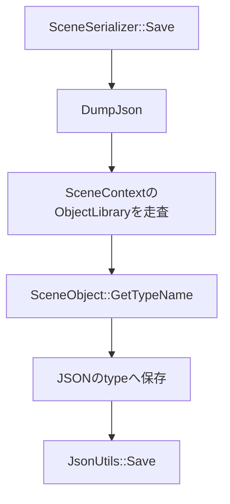
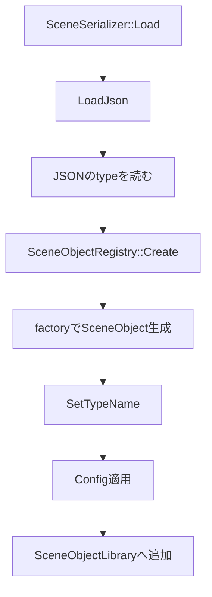
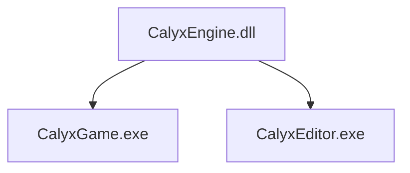

# Calyx Engine DLL化とGame/Editor分離設計

このREADMEは、エンジンをDLLとして参照する構成、Game/Editorの分離、公開API、SceneObject型登録の方針をまとめたものです。

## 1. 目的

以前はゲーム側がエンジンを静的libとして参照していました。  
その構成では、ヘッダ内に実体を持つsingletonやstatic stateが、エンジン側とゲーム側で別インスタンスとして存在する危険がありました。

その結果、ゲーム側から参照したsingletonと、エンジン内部で使っているsingletonが一致せず、クラッシュや状態不整合の原因になります。

この問題を避けるため、エンジンは `CalyxEngine.dll` としてビルドし、Game/EditorはそのDLLを参照する形に変更しました。

## 2. 現在のプロジェクト構成

主なプロジェクトは以下です。

| プロジェクト | 種別 | 役割 |
| --- | --- | --- |
| `CalyxEngine.vcxproj` | DLL | エンジン本体 |
| `CalyxGame.vcxproj` | EXE | ゲーム実行ファイル |
| `CalyxEditor.vcxproj` | EXE | エディタ実行ファイル |
| `CalyxLauncher.vcxproj` | EXE | ランチャー |

`CalyxEngine.vcxproj` は `CalyxEngine.dll` と `CalyxEngine.lib` を出力します。

ここで生成される `CalyxEngine.lib` は静的ライブラリではなく、DLLをリンクするための import library です。  
そのため、DLL構成でも `.lib` が生成されるのは正常です。

## 3. Gameフォルダ構成

ゲームコードは `Game` 配下に置きます。

```text
Game/
  main.cpp
  GameApplication.h
  GameApplication.cpp
  Demo/
    3D/
    Input/
    Scene/
```

以前の `Game/Source` は階層が冗長だったため廃止しました。  
ゲームリポジトリとして切り出す場合も、`Game` 配下をそのまま移動しやすい構成にしています。

## 4. Engine参照方法

Game/Editorは `CalyxEngineReference.props` を通じてエンジンのパスを参照します。

主な共有設定:

| MSBuildプロパティ | 内容 |
| --- | --- |
| `CalyxEngineProject` | `CalyxEngine.vcxproj` への参照 |
| `CalyxDirectXTexProject` | DirectXTexプロジェクトへの参照 |
| `CalyxEngineIncludeDirs` | Engine/include/external include path |
| `CalyxReflectionTool` | reflection generatorのパス |

Game/Editor側は `ProjectReference` で `CalyxEngine.vcxproj` を参照します。  
これにより、先に `CalyxEngine.dll` がビルドされ、Game/Editorはその import lib をリンクします。

## 5. CALYX_API

DLL外から参照するエンジンAPIには `CALYX_API` を付けます。

定義場所:

```text
Engine/Foundation/Export/CalyxAPI.h
```

概念:

```cpp
#if defined(CALYX_ENGINE_EXPORTS)
#define CALYX_API __declspec(dllexport)
#else
#define CALYX_API __declspec(dllimport)
#endif
```

`CalyxEngine.vcxproj` では `CALYX_ENGINE_EXPORTS` を定義します。  
Game/Editor側では定義しないため、同じヘッダを include しても `dllimport` として扱われます。

## 6. 何を公開するか

すべてのクラスを公開するのは避けます。  
DLL境界に出すものが増えるほど、ABI、STL型、所有権、CRTの問題が増えるためです。

公開対象の目安:

| 公開するもの | 理由 |
| --- | --- |
| Gameが継承する基底クラス | `SceneObject`, `BaseGameObject`, `Actor`, `BaseScene` など |
| Gameが直接呼ぶ関数 | `Calyx::Run` など |
| Game/Editorが使う値型 | `Vector2`, `Vector3`, `Quaternion`, `Guid` など |
| Editorが必要とするEngine API | Project, Asset, Scene関連の一部 |
| ImGui/IGFD | Editor EXEが直接UIを描画するため |

注意点:

- STLコンテナを含むクラス全体の export はできるだけ避けます。
- 必要な関数だけ `CALYX_API` を付ける方が安全です。
- `TextureManager` のようにコピー不可なメンバを持つクラスは、クラス全体ではなく関数単位で公開します。

## 7. Game側DLLは現時点では不要

現在の方針では、ゲームコードは `CalyxGame.exe` に含めます。  
そのため `CALYX_GAME_API` は不要です。

将来的に、EditorやLauncherがゲームDLLを動的ロードする構成にする場合は、Game側にも `CALYX_GAME_API` のような export macro が必要になります。  
ただし現段階では、GameをDLL化しないため導入していません。

## 8. SceneObjectRegistryの設計

`SceneObjectRegistry` は、文字列の `typeName` から `SceneObject` を生成するRegistryです。

主な用途:

- エディタ配置
- シーンロード
- Prefabロード
- 配置パネルの一覧表示

以前は `std::unique_ptr<ISceneCtor>` をRegistryへ渡していました。  
これはDLL境界で「Game側で確保したオブジェクトをEngine側で破棄する」形になり、CRTやheap所有権の問題が起きやすい設計でした。

現在は、factory関数ポインタを登録します。

```cpp
using SceneObjectFactory = std::shared_ptr<SceneObject>(*)();
```

生成時には以下の流れになります。

```mermaid
flowchart LR
    A[typeName] --> B[SceneObjectRegistry]
    B --> C[factory関数]
    C --> D[std::make_shared<T>]
    D --> E[SceneObject]
    E --> F[SetTypeName(typeName)]
```

この形により、ctorオブジェクトの所有権をDLL境界で渡さずに済みます。

## 9. CALYX_OBJECTと型保存

`CALYX_OBJECT(...)` は、エンジンに型を知らせるためのマーカーです。  
エディタに配置するためだけのマクロではありません。

例:

```cpp
CALYX_OBJECT(Category = GameObject, DisplayName = "Demo Player", Icon = "UI/Tool/cube.dds")
class DemoPlayer : public Actor {
};
```

ビルド時に generator がこのクラスを検出し、登録コードを生成します。

生成される登録の概念:

```cpp
SceneObjectClassDesc desc;
desc.typeName = "DemoPlayer";
desc.displayName = "Demo Player";
desc.objectType = ObjectType::GameObject;
desc.iconPath = "UI/Tool/cube.dds";
desc.placeable = true;
desc.factory = &CreateSceneObject<DemoPlayer>;
SceneObjectRegistry::Get().Register(desc);
```

`TypeName` を明示した場合は、その名前が保存・ロードに使われます。

```cpp
CALYX_OBJECT(TypeName = "Player", Category = GameObject, DisplayName = "Demo Player")
class DemoPlayer : public Actor {
};
```

この場合、シーンJSONには以下のように保存されます。

```json
{
  "type": "Player"
}
```

## 10. エディタ配置しない型

シーン保存やロードには必要だが、エディタの配置パネルには出したくない型があります。  
その場合は `Placeable = false` を指定します。

```cpp
CALYX_OBJECT(Category = GameObject, TypeName = "RuntimeOnlyObject", Placeable = false)
class RuntimeOnlyObject : public SceneObject {
};
```

この型はRegistryには登録されるため、保存・ロードには使えます。  
ただし `PlaceToolPanel` の一覧には表示されません。

## 11. GetObjectClassNameを毎回overrideしない

以前は各クラスで以下のようなoverrideを書いていました。

```cpp
std::string_view GetObjectClassName() const override { return "DemoPlayer"; }
```

現在は、`SceneObjectRegistry::Create()` が生成したオブジェクトに `SetTypeName(typeName)` を行います。  
そのため、`CALYX_OBJECT(...)` で登録された型は `GetTypeName()` から保存用の型名を取得できます。

シーン保存では `GetObjectClassName()` ではなく `GetTypeName()` を使います。

```cpp
jOne["type"] = std::string(sp->GetTypeName());
```

これにより、ゲーム側で毎回 `GetObjectClassName()` をoverrideする必要はありません。

注意:

- Registryを通さずに `std::make_shared<T>()` で直接生成した場合、`typeName` は自動設定されません。
- 保存対象のSceneObjectは、基本的に `SceneObjectRegistry::Create()` 経由で生成する運用に寄せます。

## 12. 保存・ロード経路

シーン保存の経路:



シーンロードの経路:



保存時にRegistryが直接ファイルを書き出すわけではありません。  
Registryは「type名から生成する」責務を持ち、保存処理は `SceneSerializer` が担当します。

## 13. Game/Editorの関係

現在は、GameとEditorはどちらもEXEです。  
どちらも `CalyxEngine.dll` を参照します。



Game固有オブジェクトは `Game` 配下にあり、`CalyxGame.vcxproj` と `CalyxEditor.vcxproj` の両方でコンパイル対象にしています。  
これにより、Editor上でもGame固有オブジェクトを配置・保存・ロードできます。

将来的にGame DLL化する場合は、EditorがGame DLLをロードし、そのDLL内の登録関数を呼ぶ設計に移行できます。  
ただし現段階では、Game DLL化は行っていません。

## 14. 警告と構成上の工夫

### assimpのPDB警告

`assimp-vc143-mt(d).lib` から `LNK4099` が出ていたため、`CalyxEngine.vcxproj` のLink設定に以下を追加しました。

```text
/IGNORE:4099
```

実際にassimpをリンクしているのはEngine DLLなので、Game/EditorではなくEngine側に設定しています。

### DirectXTexのDevelop構成

`CalyxGame.vcxproj` や `CalyxEditor.vcxproj` を直接 `Develop|x64` でビルドすると、DirectXTexの `Develop|x64` を直接参照して失敗していました。  
SolutionではDevelopからDirectXTex Releaseへマップされていたため、ProjectReferenceにも同じ意図を反映しました。

現在はCalyx側がDevelopでも、DirectXTexはRelease構成で参照します。

### /MT と /MD

現在は `/MT` 系を維持しています。  
理由は、既存のassimp/DirectXTexが `/MT` 寄りの構成で用意されているためです。

ただし、DLL境界でSTL型やheap所有権を渡す設計は危険です。  
そのため、以下の方針を取っています。

- 所有権をDLL境界で渡さない
- `unique_ptr` などをGameからEngineへ渡さない
- 必要なAPIだけを公開する
- 将来的に外部ライブラリも含めて `/MD` に統一できるなら、その方がDLL境界としては安定する

## 15. 実装時の注意点

新しいGameオブジェクトを追加する場合:

1. `Game` 配下にクラスを作る
2. ヘッダで `CalyxReflection.h` をincludeする
3. クラス定義の直前に `CALYX_OBJECT(...)` を書く
4. デフォルトコンストラクタで生成できるようにする
5. エディタに出したくなければ `Placeable = false` を付ける
6. `GetObjectClassName()` は基本的にoverrideしない
7. cppに `REGISTER_SCENE_OBJECT(...)` を書かない

例:

```cpp
#include <Engine/Foundation/Reflection/CalyxReflection.h>
#include <Engine/Objects/3D/Actor/Actor.h>

CALYX_OBJECT(Category = GameObject, DisplayName = "Enemy", Icon = "UI/Tool/cube.dds")
class Enemy : public Actor {
public:
    Enemy();
};
```

内部用で配置しない型:

```cpp
CALYX_OBJECT(Category = GameObject, TypeName = "EnemyRuntimeState", Placeable = false)
class EnemyRuntimeState : public SceneObject {
public:
    EnemyRuntimeState();
};
```

## 16. 現在確認済みのビルド

以下は確認済みです。

```text
CalyxGame   Debug   x64
CalyxGame   Release x64
CalyxGame   Develop x64

CalyxEditor Debug   x64
CalyxEditor Release x64
CalyxEditor Develop x64
```
