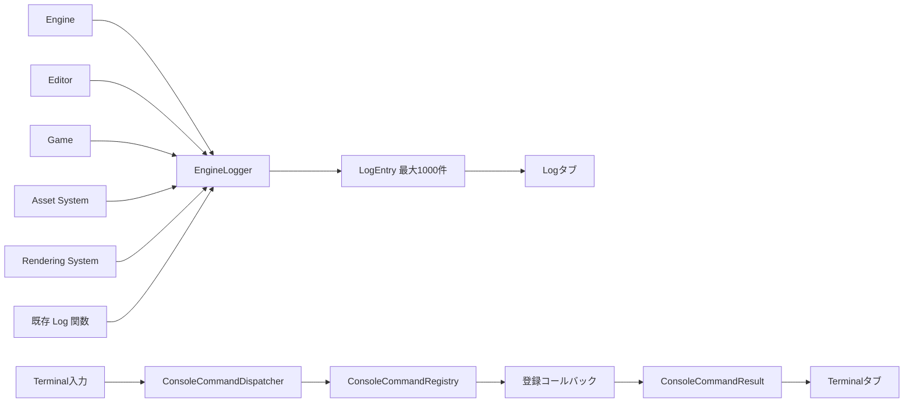

# ログ・ターミナル機能設計

コマンドシステムのプログラム構成、設計上の工夫、他方式との比較は`Docs/ConsoleCommandSystemDesignReadme.md`を参照する。

## 1. 目的

CalyxEngineの実行状況、エディタ操作、アセット処理、描画初期化、エラー情報をエディタ上で確認するため、ログ表示機能を実装した。

ログ機能は単なるImGuiの文字列一覧ではなく、エンジン、ゲーム、エディタのどこからでも利用できる共通サービスとして構成している。UIとログ蓄積を分離しているため、将来的にファイル保存、外部デバッガ出力、ネットワーク送信等の出力先を追加しやすい。

同じウィンドウ内には、将来のデバッグコマンド実行機能へ発展させるためのターミナルも用意している。

```text
Tools
  └─ Log
       ├─ Logタブ
       │    ├─ ログ一覧
       │    ├─ レベルフィルタ
       │    ├─ テキスト検索
       │    └─ 選択ログ詳細
       └─ Terminalタブ
            ├─ コマンド履歴
            ├─ コマンド応答
            └─ コマンド入力
```

## 2. 全体構成

ログデータ、蓄積サービス、UI、コマンド処理を次のように分離している。



重要な責務分離は次の通り。

| 構成要素 | 責務 |
| --- | --- |
| `LogEntry` | ログ1件分のレベル、カテゴリ、本文、発生元、時刻を保持 |
| `EngineLogger` | ログの追加、保持上限、クリア、スナップショット取得 |
| `LogPanel` | Log/Terminalタブを持つエディタウィンドウ |
| `TerminalPanel` | 親ウィンドウ内へターミナルUIを描画し、履歴を保持 |
| `ConsoleCommandDispatcher` | コマンド文字列を解釈し、UI非依存の実行結果を返す |

`EngineLogger`と`ConsoleCommandDispatcher`はImGuiをincludeしない。ImGui依存は`LogPanel`と`TerminalPanel`へ閉じている。

## 3. 主な関連ファイル

| ファイル | 役割 |
| --- | --- |
| `Engine/Foundation/Log/LogTypes.h` | `LogLevel`、`LogCategory`、`LogEntry`の定義 |
| `Engine/Foundation/Log/EngineLogger.h/.cpp` | 共通ログ蓄積サービスと出力マクロ |
| `Engine/Application/UI/Panels/LogPanel.h/.cpp` | Log/Terminal統合ウィンドウとLogタブ |
| `Engine/Application/UI/Panels/TerminalPanel.h/.cpp` | Terminalタブの表示、入力、履歴管理 |
| `Engine/System/Command/ConsoleCommandDispatcher.h/.cpp` | `help`、`clear`、未知コマンドの処理 |
| `Engine/System/Command/ConsoleCommandRegistry.h/.cpp` | Engine/Game共通のコマンド登録、検索、実行 |
| `Engine/System/Command/Manager/CommandManager.cpp` | エディタコマンドの実行、Undo、Redoログ |
| `Engine/System/Command/EditorCommand/GuizmoCommand/ScopedGizmoCommand.cpp` | Move、Rotate、Scale操作名の確定 |
| `Engine/Editor/LevelEditor.h/.cpp` | パネル生成、`editorPanels_`登録、Toolsメニュー連携 |
| `Engine/Foundation/Utility/Converter/ConvertString.cpp` | 既存グラフィックスログの`EngineLogger`連携 |
| `Engine/Assets/DataAsset/DataAssetManager.cpp` | マテリアル等のデータアセット読込・保存ログ |
| `Engine/Assets/Model/ModelManager.cpp` | モデルのキュー投入、キャッシュ利用、CPU/GPU読込完了ログ |
| `Engine/Objects/3D/Actor/BaseGameObject.cpp` | SceneObjectへ割り当てるモデルの変更ログ |
| `Engine/Assets/Model/BaseModel.cpp` | モデルのマテリアル・テクスチャ割当変更ログ |

## 4. ログデータ

ログ1件は`LogEntry`として保持する。

```cpp
struct LogEntry {
    std::uint64_t id;
    LogLevel level;
    LogCategory category;
    std::string message;
    std::string source;
    std::chrono::system_clock::time_point time;
};
```

`id`はログ追加ごとに増加する。UIは配列indexではなくIDで選択状態を保持するため、保持上限によって古いログが削除されても選択対象が別の行へずれない。

`time`は追加時に`std::chrono::system_clock::now()`から記録し、Logタブでは`HH:MM:SS`形式で表示する。

## 5. ログレベル

| レベル | 用途 | 表示色 |
| --- | --- | --- |
| `Trace` | シェーダーコンパイル、内部処理完了、詳細診断 | グレー |
| `Info` | 初期化完了、シーン切替、保存、Play状態変更 | 通常色 |
| `Warning` | 復旧可能な問題、無効な操作、アセット不足 | 黄色 |
| `Error` | ファイル読込失敗、DirectX生成失敗、処理継続不能な問題 | 赤 |

WarningとErrorはレベル名だけでなく、ログ行全体へ色を適用する。メッセージや発生元を含めて見落としにくくするためである。

### レベル選択基準

- 正常系の細かい内部処理は`Trace`にする。
- ユーザー操作や主要な状態変更は`Info`にする。
- フォールバックできる問題は`Warning`にする。
- 要求された処理が完了しなかった場合は`Error`にする。
- 毎フレーム通る正常処理にはログを配置しない。

## 6. ログカテゴリ

| カテゴリ | 対象例 |
| --- | --- |
| `Engine` | エンジン起動、終了、プロジェクト、シーン管理 |
| `Editor` | パネル、Scene Save/Open、エディタ操作 |
| `Game` | Play、Pause、ゲームシーン遷移 |
| `Asset` | AssetDatabase、モデル、テクスチャ、メタファイル |
| `Rendering` | DirectX、シェーダー、PSO、レンダーターゲット |
| `Physics` | 物理初期化、衝突設定、物理エラー |
| `Command` | 将来ログへ記録するコンソールコマンド関連処理 |

カテゴリはログの発生領域を表し、レベルは重要度を表す。同じErrorでも、AssetのファイルエラーとRenderingのGPUエラーを区別できる。

## 7. EngineLogger

`EngineLogger`はシングルトンとして提供され、エンジンDLL外のゲームコードからも利用できるよう`CALYX_API`で公開している。

```cpp
EngineLogger::GetInstance().Add(
    LogLevel::Info,
    LogCategory::Game,
    "Stage initialized.",
    "GameScene");
```

簡単なエンジンカテゴリのログにはマクロを利用できる。

```cpp
CYLOG_TRACE("Loading started.");
CYLOG_INFO("Initialization completed.");
CYLOG_WARN("Optional asset was not found.");
CYLOG_ERROR("Initialization failed.");
```

マクロを使用した場合、カテゴリは`Engine`、sourceは`__FUNCTION__`になる。ゲームやアセット等のカテゴリを明示したい場合は`Add`を直接使用する。

### 保持上限

ログはデフォルトで最大1000件保持する。上限を超えた場合は最も古いログから削除する。

```cpp
EngineLogger::GetInstance().SetMaxEntries(2000);
```

保持件数を制限することで、長時間のエディタ実行でもメモリ使用量が無制限に増えない。

### スレッド対応

追加、クリア、取得、保持件数変更は`std::mutex`で保護している。モデルロード等のワーカースレッドからログが追加されても、UI側は`GetEntries()`で安全なコピーを取得できる。

UIは1フレームにつき1回スナップショットを取得し、そのフレーム中は同じ内容を描画する。

## 8. Logタブ

Logタブには次の機能がある。

- 時刻、レベル、カテゴリ、メッセージ、sourceの一覧表示
- Trace、Info、Warning、Errorの個別表示切替
- 大文字・小文字を区別しないテキスト検索
- `Clear`による全ログ消去
- `Auto Scroll`切替
- 新しいログ追加時の末尾スクロール
- ログ行の選択
- 選択ログの詳細表示

検索対象にはレベル、カテゴリ、メッセージ、sourceを含む。例えば`Rendering`、`SceneSerializer`、ファイル名の一部等で絞り込める。

Auto Scrollは新しいログIDを検出したフレームだけ実行する。過去ログを読んでいる間に毎フレーム末尾へ戻されることを防いでいる。

## 9. Terminalタブ

Terminalタブはログ表示とは独立した履歴を持つ。Terminalの`/clear`やClearボタンを使用しても、`EngineLogger`のログは削除されない。

### 9.1 基本的な使い方

1. DebugまたはDevelop構成でエディタを起動する。
2. メニューバーの`Tools`から`Log`パネルを開く。
3. パネル上部の`Terminal`タブへ切り替える。
4. 下部の`> command input...`へコマンドを入力する。
5. Enterキーで実行する。

コマンドは必ず`/`から入力する。コマンド名は大文字・小文字を区別しない。引数を指定する場合は、コマンド名の後ろを空白で区切る。

```text
/help
/help scene.open
/object.select Player
```

最初に`/help`を実行すると、現在レジストリへ登録されている全コマンドを確認できる。Game側で追加登録したコマンドも自動的に一覧へ含まれる。

```text
> /help
Available commands:
  /asset.rescan - Rescan the current project's asset directory.
  /clear - Clear the terminal history.
  ...
Use '/help <command>' for usage details.
```

コマンドの引数数や実行状態が正しくない場合は、赤色のエラーと正しいUsageを表示する。

```text
> /scene.open
Usage: /scene.open <path>
```

### 9.2 コマンド一覧

現在利用できる組み込みコマンドは次の通り。

| コマンド | 引数 | 動作 |
| --- | --- | --- |
| `/help [command]` | 任意でコマンド名を1つ | コマンド一覧または指定コマンドの説明とUsageを表示 |
| `/clear` | なし | Terminalの履歴だけを消去 |
| `/scene.current` | なし | 現在のシーン名と保存パスを表示 |
| `/scene.save` | なし | 現在のシーンを保存 |
| `/scene.open <path>` | シーンファイルパス | 指定したシーンをエディタで開く |
| `/object.list` | なし | 現在シーンのオブジェクト名、型、GUIDを一覧表示 |
| `/object.select <name\|guid>` | オブジェクト名またはGUID | 完全一致したオブジェクトを選択 |
| `/object.delete <name\|guid>` | オブジェクト名またはGUID | オブジェクトをUndo可能なコマンドとして削除 |
| `/asset.rescan` | なし | 現在のAssetDatabaseを再走査 |
| `/play.start` | なし | Playモードを開始 |
| `/play.pause` | なし | Play中のPause/Resumeを切り替え |
| `/play.stop` | なし | Playモードの終了を要求 |

未知のコマンドは`Unknown command: コマンド名`として警告色で表示する。

Terminal履歴は最大500行保持する。入力コマンドは青系、通常応答は通常色、Warningは黄色、Errorは赤で表示する。

空白を含む名前やパスは引用符で囲む。

```text
/scene.open "Scenes/Test Stage.scene"
/object.select "Main Camera"
/object.delete "Temporary Object"
```

ダブルクォートとシングルクォートの両方に対応する。閉じていない引用符は実行せず、構文エラーをTerminalへ返す。

`/`からコマンド名を入力すると、入力欄の直上に候補一覧をリアルタイム表示する。左列にコマンド名、右列に登録時の説明を表示する。

```text
/scene.c
  /scene.current    Show the current scene name and path.
```

候補は`↑/↓`で選択でき、TabまたはEnterで選択中のコマンドを補完できる。候補をクリックしても補完できる。補完後は引数を続けて入力できるよう末尾へ空白を追加する。

入力済みの名前がコマンド名と完全一致する場合、Enterは補完ではなくコマンド実行になる。空の入力欄でTabを押した場合は`/`を挿入し、登録済みの全候補を表示する。

現在のTab補完対象はコマンド名だけである。ファイルパス、SceneObject名、GUID等の引数補完は今後の拡張対象とする。

### 9.3 ヘルプと履歴操作

#### `/help [command]`

引数なしでは全コマンドを名前順に表示する。コマンド名を指定すると、説明と正しい入力形式を表示する。

```text
> /help object.delete
/object.delete - Delete an object by exact name or GUID. The operation supports Undo.
Usage: /object.delete <name|guid>
```

#### `/clear`

Terminal内の入力・応答履歴を消去する。LogタブのEngineログには影響しない。上部のClearボタンも同じ動作になる。

### 9.4 シーンコマンド

#### `/scene.current`

現在のシーン名とファイルパスを確認する。まだ保存されていないシーンは`<unsaved>`と表示する。

```text
> /scene.current
Scene: GameScene | Path: Resources/Assets/Scenes/GameScene.scene
```

#### `/scene.save`

現在のシーンを保存する。保存パスが設定済みならそのファイルへ保存する。未保存の場合は、アセットルートの`Scenes/シーン名.scene`を保存先として使用する。

```text
> /scene.save
Scene saved: Resources/Assets/Scenes/GameScene.scene
```

保存結果はTerminalへ返すだけでなく、`SceneSerializer`からLogタブにも記録される。

#### `/scene.open <path>`

指定したシーンファイルをエディタで開く。相対パスはアセットルート基準で解決される。パスに空白がある場合は引用符で囲む。

```text
/scene.open Scenes/Title.scene
/scene.open "Scenes/Test Stage.scene"
```

シーンを開くと現在の選択状態が解除され、HierarchyとInspectorが新しい`SceneContext`へ再接続される。

### 9.5 オブジェクトコマンド

#### `/object.list`

現在シーンに登録されているSceneObjectを一覧表示する。表示形式は`名前 [型名] GUID`である。

```text
> /object.list
Objects: 2
  Player [PlayerObject] 01234567-89ab-cdef-0123-456789abcdef
  Main Camera [Camera3d] fedcba98-7654-3210-fedc-ba9876543210
```

#### `/object.select <name|guid>`

オブジェクト名の完全一致、またはGUIDで対象を選択する。

```text
/object.select Player
/object.select "Main Camera"
/object.select 01234567-89ab-cdef-0123-456789abcdef
```

同じ名前のオブジェクトが複数存在する場合は誤操作を避けるため実行せず、GUIDの指定を要求する。

#### `/object.delete <name|guid>`

指定したオブジェクトを削除する。検索規則は`/object.select`と同じである。

```text
/object.delete "Temporary Object"
```

削除処理は`LevelEditor::DeleteObject`から`CommandManager`を経由するため、通常のエディタ操作と同様にUndoできる。子オブジェクトを持つRootを削除した場合は、その階層も削除コマンドのスナップショットへ含まれる。

### 9.6 アセットコマンド

#### `/asset.rescan`

現在のアセットルートを再走査し、新規・更新・削除されたアセットを`AssetDatabase`へ反映する。

```text
> /asset.rescan
Asset rescan completed. Records=128
```

ファイル数によっては完了まで時間がかかる。スキャン結果の詳細はLogタブの`Asset`カテゴリへも出力される。

### 9.7 Playコマンド

#### `/play.start`

EditorモードからPlayモードへ移行する。既にPlay、Pause、Step状態の場合は実行しない。

#### `/play.pause`

Playing状態ではPauseへ、Paused状態ではPlayingへ戻す。他の状態ではエラーを返す。

#### `/play.stop`

実行中のPlaySessionへ終了を要求する。実際のRuntime Context破棄は通常のPlay終了処理で安全に行われる。

```text
/play.start
/play.pause
/play.pause
/play.stop
```

### 9.8 コマンド処理の設計

`ConsoleCommandDispatcher`は入力をコマンド名と引数へ分割し、`ConsoleCommandRegistry`へ実行を委譲する。ImGuiへ直接書き込まず、次の結果を返す。

```cpp
struct ConsoleCommandResult {
    bool clearRequested;
    std::vector<ConsoleOutputLine> output;
};
```

各コマンドには`ConsoleCommandContext`を渡す。コマンドはグローバル探索に依存せず、許可された`LevelEditor`、`SceneManager`、`PlaySession`へアクセスする。

### 9.9 Engine/Game側からのコマンド登録

EngineまたはGame側からコマンドを登録できる。短い処理はラムダ式でもよいが、通常は追加・テストしやすい名前付きハンドラーと`RegisterAll`を推奨する。

```cpp
namespace GameConsoleCommands {
    ConsoleCommandResult Reload(
        const ConsoleCommandContext& context,
        const std::vector<std::string>& arguments) {
        if(!arguments.empty()) {
            return {
                false,
                {{ConsoleOutputLevel::Error, "Usage: /game.reload"}}
            };
        }

        // ゲーム固有データを再読込する。
        return ConsoleCommandResult{
            false,
            {{ConsoleOutputLevel::Info, "Game data reloaded."}}};
    }

    void RegisterAll(ConsoleCommandRegistry& registry) {
        registry.Register({
            "game.reload",
            "Reload game-specific data.",
            "/game.reload",
            Reload
        });
    }
}

// ゲームモジュール初期化時
GameConsoleCommands::RegisterAll(
    ConsoleCommandRegistry::GetInstance());
```

コマンド名は登録時と検索時に小文字へ正規化する。同名コマンドを再登録した場合は新しい定義で上書きする。`GetCommands()`は名前順の一覧を返すため、`/help`やTab補完で共用できる。

登録時の各フィールドは次の意味を持つ。

| フィールド | 内容 |
| --- | --- |
| `name` | Terminalへ入力する一意なコマンド名 |
| `description` | `/help`一覧へ表示する短い説明 |
| `usage` | `/help <command>`と引数エラーで案内する入力形式 |
| `callback` | Contextと引数配列を受け取り、実行結果を返す処理 |

ゲーム固有コマンドは、ゲームモジュールの初期化時に登録する。モジュールのアンロードに対応する場合は、終了時に`Unregister("game.reload")`を呼び、アンロード済みDLLのコールバックがレジストリへ残らないようにする。

ラムダ式は`/clear`のような数行で完結する処理に限定する。シーン、オブジェクト、アセット等のコマンドは`SceneConsoleCommands.cpp`、`ObjectConsoleCommands.cpp`のように機能別ファイルへ分ける。

## 10. 現在ログを配置している主な処理

| システム | 出力内容 |
| --- | --- |
| `CalyxCore` | エンジン初期化開始/完了、終了開始/完了 |
| `DxCore` | DirectX初期化、レンダーターゲット生成、Resize、コマンドリスト失敗、解放 |
| `ImGuiManager` | ImGui初期化/終了、フォント不足 |
| `AssetManager` | 各アセットマネージャーとAudioの初期化/終了 |
| `AssetDatabase` | 初期化、ルート生成失敗、スキャン件数、メタファイル書込失敗 |
| `Project` | プロジェクト読込、保存、作成と各失敗理由 |
| `SceneManager` | シーン登録、読込、切替要求、無効な切替、Contextクリア |
| `SceneSerializer` | シーン保存/読込、読込オブジェクト数、未登録型、外部Config不足 |
| `LevelEditor` | LogPanel初期化、Scene Save、Object Create/Delete |
| `PlaySession` | Play、Pause、Resume、Step、Restart、Stop |
| `PipelineStateObject` | Graphics/Compute PSO生成失敗 |
| `CommandManager` | コマンド実行、Undo、Redo、オブジェクト追加・削除・複製 |
| `ScopedGizmoCommand` | Move、Rotate、Scaleの操作確定 |
| `MaterialNodeEditorPanel` | ノード追加、削除、接続、値編集等のマテリアルグラフ変更 |
| `DataAssetManager` | マテリアル読込、作成、保存、保存失敗 |
| `BaseGameObject` | SceneObjectに割り当てたモデル名の変更と失敗 |
| `BaseModel` | マテリアルGUID、テクスチャGUIDの変更と解除 |
| `ModelManager` | モデルロード要求、キャッシュ利用、CPU/GPUリソース生成完了 |
| 既存`Log(...)` | DXC、シェーダーコンパイル、シェーダーキャッシュ、DirectX診断 |

### オブジェクト操作ログ

オブジェクトの追加、削除、複製等はUndo/Redo対応のエディタコマンドとして実行される。`CommandManager`で共通ログを出すことで、各コマンドへ個別のログ処理を重複実装しない。

```text
Command executed: Delete Object
Command undone: Delete Object
Command redone: Delete Object
```

ギズモによる移動、回転、拡縮はドラッグ中に毎フレーム値が変化する。ドラッグ中にログを出すと数百件単位のノイズになるため、`ScopedGizmoCommand`が確定して`CommandManager`へ登録された時点で1件だけ記録する。

```text
Command executed: Move Object
Command executed: Rotate Objects
Command executed: Scale Object
```

実際のログでは、SceneObjectを特定できた場合に対象名も末尾へ追加する。

```text
Command executed: Move Object: Player
Command executed: Rotate Objects: EnemyA, EnemyB
```

複数選択時は`Objects`、単一選択時は`Object`として操作対象数を区別する。対象が4件以上の場合は先頭3件と`...`を表示し、メッセージが過度に長くなることを防ぐ。

### マテリアル変更ログ

マテリアルノードの追加、削除、リンク、パラメータ編集は、変更確定時にマテリアル名とコマンド名を記録する。

```text
Material graph changed: PlayerMaterial (Add Material Node)
Command executed: Edit Material Node
Data asset saved: Resources/Assets/Materials/PlayerMaterial.mat
```

ノードのドラッグや数値入力中ではなく、編集コマンドが確定した時点で出力する。ファイル保存は`DataAssetManager::SaveAsset`で一元的に成功・失敗を記録する。

### モデルデータ変更ログ

SceneObjectへ割り当てるモデルを変更した場合は、オブジェクト名、変更前モデル、変更後モデルを記録する。

```text
Model changed for object 'Player': player_old.gltf -> player.gltf
```

モデル内部のマテリアルやテクスチャ割当はGUIDの変更として記録する。非同期モデルロードは、要求のキュー投入、キャッシュ利用、CPU/GPUロード完了をそれぞれ記録する。

通常のロード要求とキャッシュ利用は`Trace`、ユーザーが確認すべき割当変更とロード完了は`Info`としている。

## 11. 既存グラフィックスログとの互換性

既存コードでは`ConvertString.h`のグローバル`Log(const std::string&)`を使い、Visual StudioのDebug Outputへ文字列を出していた。

この関数はDebug Outputへの出力を維持したまま、同じメッセージを`EngineLogger`にも追加する。

文字列内の単語からレベルを次のように分類する。

```text
error / failed / failure を含む  -> Error
warning を含む                   -> Warning
その他                            -> Trace
```

カテゴリは`Rendering`、sourceは`GraphicsDebugOutput`になる。これにより既存のシェーダーコンパイラー等を全面的に書き換えず、エディタのLogタブへ診断を集約できる。

## 12. ログを追加する際の方針

ログは多いほどよいわけではない。調査に必要な状態変化と失敗理由を残し、フレーム単位のノイズを避ける。

### 追加を推奨する箇所

- サブシステムの初期化と終了
- ファイルやアセットの読込、保存、変換
- シーン、モード、状態の切替
- オブジェクトの追加、削除、複製、Transform操作の確定
- モデル、マテリアル、テクスチャ等のアセット割当変更
- マテリアルノードグラフやモデルデータの保存
- 非同期処理の開始、完了、失敗
- フォールバック処理が発生した箇所
- DirectX APIや外部ライブラリの失敗
- ユーザー操作が拒否された理由

### 原則として追加しない箇所

- 毎フレーム成功するUpdate、Draw、Render
- オブジェクト数に比例して毎フレーム呼ばれる処理
- 呼び出し元と呼び出し先で完全に同じ内容になるログ
- 発生しても対処判断に使えないメッセージ

失敗ログには、可能な限り対象パス、オブジェクト名、HRESULT、失敗理由を含める。

```cpp
EngineLogger::GetInstance().Add(
    LogLevel::Error,
    LogCategory::Asset,
    "Texture load failed: " + texturePath,
    "TextureManager");
```

## 13. 拡張方針

今後追加しやすい機能は次の通り。

### ログ出力先

- テキストファイルへの保存
- 日付単位のログローテーション
- Visual Studio Outputへの全ログ転送
- クラッシュ時の直近ログ保存
- リモートデバッグ用ネットワーク送信

出力先は`LogPanel`ではなく`EngineLogger`側へ追加する。

### UI

- カテゴリフィルタ
- 同一メッセージの折り畳みと回数表示
- sourceクリックによるファイル移動
- ログのコピー、選択範囲保存
- Error発生時の自動パネル表示

### Terminal

- コマンド履歴の上下キー移動
- ファイルパス、SceneObject名等の引数補完
- コマンド別のEditor/Game/Debug権限指定
- エイリアス登録
- 非同期コマンド結果

## 14. 注意点

- `EngineLogger::GetEntries()`は安全性のためvectorをコピーする。現在の上限1000件では問題ないが、保持件数を大幅に増やす場合は差分取得方式を検討する。
- ログメッセージは現在`std::string`で扱う。ImGui表示へ渡す文字列はUTF-8に統一する。
- `Clear`後もログIDは再利用しない。選択状態の誤一致を防ぐためである。
- Releaseビルドでも`EngineLogger`自体は利用できるが、`LevelEditor`とLogパネルはDebug/Develop向けである。
- Terminalのコマンド応答はログへ混在させない。必要な処理だけ、コマンド実装側から明示的に`EngineLogger`へ記録する。

## 15. 動作確認

1. DebugまたはDevelop構成でエディタを起動する。
2. Toolsメニューから`Log`を開く。
3. Logタブで初期化ログが表示されることを確認する。
4. Warningが黄色、Errorが赤で表示されることを確認する。
5. レベル切替と検索欄でログを絞り込む。
6. ログ行を選択し、下部のDetailsを確認する。
7. Terminalタブへ切り替える。
8. `/help`、`/scene.current`、`/object.list`、未知のコマンド、`/clear`を順に実行する。
9. Terminalの`/clear`でLogタブのログが消えないことを確認する。
