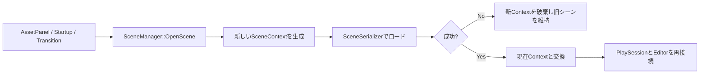

# データ駆動シーン管理設計

## 1. この文書の目的

本書は、CalyxEngineのシーン管理を「シーンごとにC++クラスを作る方式」から「`.scene`アセットを読み込んで実行する方式」へ移行するための設計方針をまとめたものです。

設計上の結論は次のとおりです。

> シーンはクラスではなくアセットとして扱います。シーン固有の振る舞いは、シーンファイルに配置できる再利用可能な`SceneObject`へ分解します。`SceneManager`はファイルの読み込み、切り替え、ライフサイクルだけを管理します。

これにより、シーンを追加するたびにC++クラス、列挙値、登録コードを追加する必要がなくなります。AssetPanelからシーンを開く操作と、ゲーム実行中のシーン遷移も同じロード経路へ統合できます。

## 2. 従来方式の問題

従来は、`.scene`ファイルが存在していても、次のような派生クラスと登録処理が必要でした。

```cpp
class DemoScene final : public BaseScene {
public:
    void Initialize() override;
    void Update(float dt) override;
};

void GameApplication::RegisterScenes(Calyx::SceneRegistry& registry) {
    registry.AddScene<DemoScene>(SceneId::Demo);
    registry.SetStartupScene(SceneId::Demo);
}
```

この方式には以下の問題があります。

- シーンファイルとシーンクラスの二重管理になる
- シーン追加のたびにビルドが必要になる
- クラス名、`SceneId`、ファイルパスの対応が手作業になる
- エディターで作成したシーンを、そのまま実行対象にできない
- `SceneId`が`uint8_t`であり、アセット識別子として拡張性が低い
- シーン固有クラスに処理が集まり、再利用しにくくなる
- AssetPanelから任意のシーンを開く処理と、ゲーム中の遷移処理が別経路になる

## 3. 新しい責務分割

```text
Application
├── GameSession                 シーンをまたいで維持するゲーム状態（計画）
├── SceneManager                読み込み、切り替え、ライフサイクル
│   └── SceneContext            現在読み込まれているシーンの実体
│       ├── SceneObject         配置物とゲームロジック
│       ├── CameraManager
│       ├── LightLibrary
│       └── FxSystem
├── AssetDatabase               .sceneのGUIDとパスを管理
└── LevelEditor / AssetPanel    シーンを開く要求を送る
```

| 要素 | 責務 | シーン切り替え時 |
| --- | --- | --- |
| `.scene` | オブジェクト構成、設定、参照関係 | ファイルから再読み込み |
| `SceneManager` | ロード、切り替え、失敗処理 | 維持 |
| `BaseScene` | 全シーン共通の描画ランタイム | 汎用実装を使用 |
| `SceneContext` | オブジェクト、カメラ、ライト、エフェクト | 破棄して再生成 |
| `SceneObject` | ゲーム内の配置物と振る舞い | シーンファイルから再生成 |
| `GameSession` | HP、所持品、進行状態など | 維持 |
| `SceneTransitionRequest` | 遷移先と出現位置などの一時情報 | 遷移完了後に消費 |
| `SaveData` | ディスクへ保存する永続データ | 必要に応じて保存・復元 |

## 4. シーンファイルの役割

`.scene`は、実行可能なC++コードそのものではなく、どの型のオブジェクトをどの設定で配置するかを表すデータです。

```json
{
  "version": 1,
  "sceneName": "Stage01",
  "objects": [
    {
      "type": "PlayerSpawnPoint",
      "guid": "...",
      "name": "EntranceA",
      "transform": {}
    },
    {
      "type": "SceneTransitionTrigger",
      "guid": "...",
      "destinationSceneGuid": "...",
      "destinationSpawnPoint": "EntranceB"
    }
  ]
}
```

`SceneSerializer`は`type`を使って`SceneObjectRegistry`からC++オブジェクトを生成し、保存されたパラメーターを適用します。このため、C++で実装する単位は「Stage01」ではなく、「SpawnPoint」「TransitionTrigger」「EnemySpawner」のような再利用可能な機能になります。

## 5. シーンを開く処理

シーンを開く入口は`SceneManager::OpenScene()`へ統一します。LevelEditorやAssetPanelが`SceneSerializer`を直接操作しないことが重要です。



現在の`OpenScene()`は、新しい`SceneContext`への読み込みが成功してから現在のコンテキストを交換します。読み込み前に現在のシーンを消去しないため、ファイルが存在しない場合やJSONの読み込みに失敗した場合にも、編集中のシーンを維持できます。

エディターの再生中または一時停止中に、AssetPanelから編集用シーンを差し替える操作は拒否します。実行用Contextと編集用Contextの対応が崩れることを防ぐためです。ゲーム中の正式なシーン遷移は、後述する遷移キュー経由で処理します。

## 6. AssetPanelと起動シーン

`.scene`は`AssetType::Scene`として`AssetDatabase`へ登録されます。これにより、他のアセットと同様にGUID、メタファイル、検索、フィルターの対象になります。

AssetPanelでは次の操作を提供します。

- `.scene`のダブルクリックで開く
- コンテキストメニューの`Open Scene`で開く
- `All Scenes`フィルターでシーンだけを表示する

起動シーンは`.calyxproj`の`startupScene`から直接読み込みます。

```json
{
  "startupScene": "Resources/Assets/Scenes/DemoScene.scene"
}
```

現在は互換性のためパスを保存しています。将来的には`startupSceneGuid`を正とし、パスを表示・復旧用情報として併記します。GUIDを正にすると、AssetPanelでファイルを移動または改名しても参照を維持できます。

## 7. シーン固有処理の置き場所

シーンクラスに書いていた処理は、責務ごとの`SceneObject`へ移します。

| 従来シーンクラスにあった処理 | 新しい配置先 |
| --- | --- |
| ステージクリア条件 | `StageController` |
| 敵の出現とウェーブ管理 | `EnemySpawner` / `WaveController` |
| シーン遷移判定 | `SceneTransitionTrigger` |
| プレイヤーの出現位置 | `PlayerSpawnPoint` |
| BGM、環境音 | `SceneAudioSettings` |
| カットシーン進行 | `EventSequenceController` |
| ステージ固有ギミック | 対応するギミック用`SceneObject` |
| 全ステージ共通ルール | `GameApplication`またはゲームシステム |
| シーン間で維持する状態 | `GameSession` |

現在の`SceneContext::Update()`は、ランタイム時に各`SceneObject::Update()`を呼び、エディターを含む常時更新には`AlwaysUpdate()`を呼びます。したがって、ゲームロジックは原則として`SceneObject::Update()`側へ置きます。

`IRuntimeBehaviour`には現時点で最小の`Start()`定義だけがあります。将来的には、次のライフサイクルを明示的に整備する予定です。

```cpp
class IRuntimeBehaviour {
public:
    virtual void Awake() {}
    virtual void Start() {}
    virtual void Update(float dt) {}
    virtual void OnSceneExit() {}
};
```

重要なのは、シーン名に対応した巨大なControllerを作ることではありません。複数シーンで再利用できる粒度へ処理を分割し、違いをシリアライズ可能なパラメーターとして持たせます。

## 8. シーン遷移の設計

### 8.1 遷移要求

シーン遷移は即座に実行せず、要求としてキューへ積みます。

```cpp
struct SceneTransitionRequest {
    Guid destinationScene;
    std::string destinationSpawnPoint;
    TransitionStyle style = TransitionStyle::Fade;
};
```

```cpp
class SceneTransitionTrigger : public SceneObject {
public:
    void OnPlayerEnter() {
        SceneAPI::RequestTransition({
            destinationSceneGuid_,
            destinationSpawnPoint_,
            TransitionStyle::Fade
        });
    }

private:
    Guid destinationSceneGuid_;
    std::string destinationSpawnPoint_;
};
```

要求をキューへ積む理由は、`SceneObject::Update()`の途中で現在の`SceneContext`を破棄すると、イテレーターや`this`ポインターが無効になるためです。実際の交換はフレーム終端の安全なタイミングで行います。

### 8.2 遷移シーケンス

```text
Idle
  ↓ RequestTransition
FadeOut
  ↓
LoadDestination
  ↓ 成功                 ↓ 失敗
SwapContext              RestoreCurrentScene
  ↓
ApplyGameSession
  ↓
MovePlayerToSpawnPoint
  ↓
FadeIn
  ↓
Idle
```

ロードに失敗した場合は現在のシーンを維持し、エラーをログとエディターUIへ通知します。遷移要求の多重発行は、最初の要求を採用するか、優先度付きキューにするかを明示的に決めます。通常のステージ遷移では、遷移中の追加要求を拒否する方式が安全です。

### 8.3 SpawnPoint

遷移先ではオブジェクトのメモリアドレスを渡さず、SpawnPointの安定したIDまたは名前を渡します。

```cpp
class PlayerSpawnPoint : public SceneObject {
public:
    std::string spawnId;
};
```

名前は編集しやすい一方、重複や改名に弱いため、最終的にはSpawnPoint自身のGUIDか専用IDを使用するのが安全です。

## 9. GameSession

`GameSession`は、シーンを切り替えても失ってはいけない「現在のプレイ状態」です。`SceneContext`の外側で`GameApplication`または専用サービスが所有します。

```cpp
class GameSession {
public:
    PlayerState player;
    std::unordered_set<Guid> completedEvents;
    Guid currentScene;
    std::string nextSpawnPoint;
};
```

代表的な保持内容は次のとおりです。

- プレイヤーのHP、装備、所持品
- スコアとゲーム進行状況
- 解除済みイベントやチェックポイント
- 遷移先のSpawnPoint
- 難易度やラン設定

`GameSession`にシーン内オブジェクトの生ポインターや`shared_ptr`を保存してはいけません。シーン破棄後に無効になるためです。必要な参照はGUID、専用ID、または純粋な値として保持します。

| 種類 | 寿命 | 用途 |
| --- | --- | --- |
| `SceneContext` | 1シーン | 配置オブジェクトとシーン内状態 |
| `GameSession` | 1プレイセッション | シーンをまたぐ現在状態 |
| `SceneTransitionRequest` | 1回の遷移 | 遷移先、出現位置、演出 |
| `SaveData` | アプリ終了後も維持 | ディスクへ保存する永続状態 |

`GameSession`は設計済みですが、現時点ではまだエンジンへ実装されていません。

## 10. 工夫した点

### 10.1 トランザクション型ロード

現在のシーンを先に消さず、新しいContextのロード成功後にだけ交換します。失敗時に作業中のシーンを失わないことを優先しています。

### 10.2 エディターとランタイムで同じロード経路を使う

AssetPanel、Fileメニュー、起動シーン、将来のゲーム内遷移を`SceneManager`へ集約します。入口ごとに異なる初期化処理が増えることを防ぎます。

### 10.3 シーンと描画ランタイムを分離

`BaseScene`の描画機能は全シーン共通です。シーンファイルを開いたときは汎用`BaseScene`を使用し、`DemoScene`のような派生型に依存しません。また、Context交換時に旧ContextのSkyBox参照を解放し、前シーンのオブジェクトを保持しないようにしています。

### 10.4 ゲームロジックを再利用可能な型へ分解

「Stage01専用クラス」ではなく、「遷移Trigger」「SpawnPoint」「Spawner」のような意味のある部品を作ります。ステージごとの差はパラメーターと配置で表現します。

### 10.5 既存機能を一度に破壊しない

旧`SceneRegistry`、`SceneId`、シーンクラスは互換層として残しています。新経路を動作させてから、参照箇所をGUIDベースへ移し、最後に旧APIを削除します。

### 10.6 編集Contextと実行Contextを混同しない

PlaySessionは編集用シーンを複製して実行用Contextを作ります。再生中にAssetPanelから編集Contextだけを交換すると状態が不整合になるため、その操作は拒否します。ゲーム内遷移は専用の遷移処理で両者を正しく再構築します。

## 11. 他の実装方式との比較

### 11.1 シーンごとにC++クラスを作る方式

| 項目 | 評価 |
| --- | --- |
| メリット | 型安全で単純。特殊な処理を直接書きやすい。小規模なデモでは実装が速い |
| デメリット | シーン追加ごとにビルドが必要。データとコードが二重管理。処理が巨大化しやすい |
| 適する用途 | 少数の固定画面、技術デモ、完全に異なる実行モード |

完全に異なる描画パイプラインやアプリケーションモードには専用クラスが有効です。ただし、通常のステージ差分へ使用すると粒度が大きすぎます。

### 11.2 SceneManagerにシーン名ごとの分岐を書く方式

```cpp
if(sceneName == "Stage01") { ... }
else if(sceneName == "Stage02") { ... }
```

| 項目 | 評価 |
| --- | --- |
| メリット | 初期実装が簡単 |
| デメリット | Managerがゲーム固有処理へ依存する。分岐が増え続ける。テストと再利用が困難 |
| 適する用途 | 原則として採用しない |

エンジン層とゲーム層の依存方向が逆転するため、CalyxEngineでは避けます。

### 11.3 パス文字列だけで管理するデータ駆動方式

| 項目 | 評価 |
| --- | --- |
| メリット | 実装が簡単。ファイルから直接開ける |
| デメリット | 改名と移動で参照が壊れる。大文字小文字や区切り文字の問題がある |
| 適する用途 | 初期移行、デバッグ用指定、外部ファイル |

現在の起動シーンはこの方式です。最終設計ではGUIDを正とし、パスはAssetDatabaseから解決します。

### 11.4 GUIDベースのデータ駆動方式（採用方針）

| 項目 | 評価 |
| --- | --- |
| メリット | ファイル移動に強い。AssetPanelと統合しやすい。参照整合性を検査できる |
| デメリット | `.meta`管理とGUID解決が必要。ファイル単体では参照先が分かりにくい |
| 適する用途 | エディターを持つ中規模以上のゲームエンジン |

可読性を補うため、シリアライズ時にGUIDと表示用パスの両方を持つ方法もあります。ただし、正とする値はGUIDのみにします。

### 11.5 全状態をグローバルSingletonへ置く方式

| 項目 | 評価 |
| --- | --- |
| メリット | どこからでも参照できる |
| デメリット | 依存関係と寿命が不明確。テスト困難。シーン再ロードで状態が残留する |
| 適する用途 | 読み取り専用のエンジンサービスなど限定的な用途 |

`GameSession`はグローバル変数にせず、Applicationが所有してサービスとして明示的に渡します。

### 11.6 ECSのWorldを丸ごと切り替える方式

| 項目 | 評価 |
| --- | --- |
| メリット | 大量オブジェクトの処理、並列化、データ指向設計に向く |
| デメリット | 現在の`SceneObject`設計からの移行コストが大きい。エディターも作り直しになる |
| 適する用途 | 大規模シミュレーション、ECSを基盤にした新規エンジン |

CalyxEngineの現状では、`SceneContext + SceneObjectRegistry`を活用する方が移行コストと効果のバランスが良いと判断しています。

## 12. 採用方式のメリット

- `.scene`を作成する意味が明確になる
- シーン追加と配置変更にC++ビルドが不要になる
- AssetPanelから任意のシーンを開ける
- 起動シーンとゲーム中の遷移先をアセットとして指定できる
- シーン固有処理を複数ステージで再利用できる
- エンジン層がゲーム固有のシーン型を知らずに済む
- ロード失敗時に現在のシーンを維持できる
- 将来的な非同期ロード、プレビュー、依存アセット解析へ拡張しやすい
- GUID化すればファイル移動や改名に強くなる

## 13. 採用方式のデメリット

- ロジック用`SceneObject`の設計が必要になる
- シリアライズ可能なフィールドと参照方法を厳密に決める必要がある
- C++クラスだけを読んでもステージ全体の動作が分かりにくい
- 不正な型名や欠落アセットなど、データ検証が必要になる
- `GameSession`、遷移キュー、SpawnPointなど周辺基盤が必要になる
- 複雑なステージロジックを細分化しすぎると、依存関係が追いにくくなる
- GUIDは人間が直接読みづらいため、エディターUIの支援が必要になる

データ駆動化はコードを不要にする設計ではありません。コードを「シーン単位」から「再利用可能な機能単位」へ移す設計です。

## 14. 実装済み範囲

現在、以下が実装済みです。

- `AssetType::Scene`
- `.scene`のAssetDatabase登録
- AssetPanelのSceneフィルター
- AssetPanelからのダブルクリック／右クリックオープン
- `SceneManager::OpenScene(path)`
- 新Contextへ読み込んでから交換するトランザクション型ロード
- 現在のシーンパスの保持
- 現在開いているパスへの保存
- `.calyxproj`の`startupScene`からの直接ロード
- 汎用`BaseScene`によるファイルシーン実行
- 新規プロジェクトテンプレートからシーンクラス登録コードを除去
- Engine、Editor、GameのDebugビルド確認

旧`DemoScene`、`SceneRegistry`、`SceneId`関連は移行期間の互換性のため一部残っています。

## 15. 今後の実装順序

1. `SceneAssetRef`またはScene GUID参照型を追加する
2. `SceneTransitionRequest`とフレーム終端の遷移キューを実装する
3. `SceneTransitionTrigger`と`PlayerSpawnPoint`を実装する
4. `GameSession`をGameApplication所有のサービスとして実装する
5. `startupSceneGuid`をプロジェクト設定へ追加する
6. ロード時の不明型、重複GUID、欠落参照を検証する
7. Dirty状態とSave/Discard/Cancel確認をEditorへ追加する
8. `IRuntimeBehaviour`のライフサイクルを整備する
9. 既存の`SceneId`遷移をGUID遷移へ置き換える
10. `DemoScene`など不要になったシーンクラスと`SceneRegistry`を削除する

## 16. 実装・運用ルール

- UIから`SceneSerializer::Load()`を直接呼ばず、必ず`SceneManager`を通す
- `SceneManager`へゲーム固有のシーン名分岐を書かない
- シーン内オブジェクトへのポインターを`GameSession`へ保存しない
- シーン遷移を`Update()`の途中で即時実行しない
- シーン参照は最終的にGUIDを正とする
- シーン固有処理は、可能な限り再利用可能な`SceneObject`へ分割する
- エディター専用更新は`AlwaysUpdate()`、ゲーム実行処理は`Update()`へ置く
- ロード失敗時に現在のContextを破棄しない
- 保存前に型、GUID、親子参照、アセット参照を検証する
- `GameSession`と`SaveData`を同一視しない

## 17. 検証項目

- 正常なシーンをAssetPanelから開ける
- 存在しないファイルを開いても現在のシーンが維持される
- JSON破損時に現在のシーンが維持される
- シーン切り替え後に旧シーンのSkyBoxやオブジェクトが残らない
- シーン切り替え時に選択状態とUndo履歴がクリアされる
- 再生中／一時停止中に編集用シーンを直接交換できない
- 起動時に`startupScene`が読み込まれる
- シーン保存が現在開いているファイルへ行われる
- GUID移行後、シーンファイルを移動しても参照が維持される
- 遷移要求が同一フレームに複数発生しても一度だけ処理される
- 遷移先ロード失敗時にフェード解除と操作復帰が行われる
- `GameSession`の状態がシーン切り替え後も維持される

## 18. 関連ファイル

| ファイル | 役割 |
| --- | --- |
| `Engine/Scene/System/SceneManager.*` | シーンのロード、Context交換、描画接続 |
| `Engine/Scene/Serializer/SceneSerializer.*` | `.scene`の保存と読み込み |
| `Engine/Scene/Context/SceneContext.*` | シーン実体とSceneObject更新 |
| `Engine/Scene/Base/BaseScene.*` | 全シーン共通の描画ランタイム |
| `Engine/Assets/System/AssetType.h` | `AssetType::Scene`定義 |
| `Engine/Assets/Database/AssetDatabase.cpp` | `.scene`拡張子の登録 |
| `Engine/Application/UI/Panels/AssetPanel.*` | Sceneアセットの表示とオープン要求 |
| `Engine/Editor/LevelEditor.*` | エディター操作とSceneManagerの接続 |
| `Engine/Application/Framework/CalyxFrameWork.cpp` | 起動シーンのロード |
| `Engine/Application/CalyxEngine/Project.h` | `startupScene`設定 |
| `Engine/Application/System/PlaySession.*` | 編集Contextと実行Contextの分離 |
| `Engine/Scene/Transitioner/*` | 旧SceneId遷移。GUID方式へ移行予定 |

